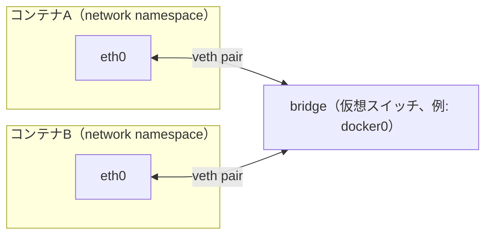

# 01 コンテナネットワークの概念

## 所要時間

約20分

## 学習目標

- Linuxのnetwork namespaceの役割を説明できる
- bridgeが仮想スイッチであることを理解する
- veth pairがコンテナとbridgeを繋ぐ仕組みを説明できる

---

## Linuxのnetwork namespaceとは

01章で触れた通り、Dockerのコンテナ隔離はLinuxカーネルの機能に依存しています。ネットワークに関して言えば、その正体は **network namespace** です。

network namespaceは、プロセスごとに以下を独立して持てるようにするLinuxカーネルの機能です。

- ネットワークインターフェース（`eth0`など）
- ルーティングテーブル
- iptablesルール
- ポート番号の空間

コンテナを起動すると、Docker Engineはそのコンテナ専用のnetwork namespaceを1つ作成します。これにより、コンテナは自分専用の「まっさらなネットワークスタック」を持ち、ホストや他のコンテナと独立してポート番号（例: 80番）を使うことができます。

## bridgeとは

複数のnetwork namespaceを1つのネットワークセグメントに繋ぐには、それらを繋ぐ「スイッチ」が必要です。それが **bridge** です。

bridgeは、Linuxカーネルが提供する仮想的なL2スイッチ（イーサネットスイッチ）です。物理的なネットワークスイッチと同じように、複数のインターフェースを1つのセグメントとして繋ぎ、フレームを転送します。

Docker Engineは、コンテナ用のネットワークを作るたびに、この仮想bridgeを1つ作成します。

## veth pair

network namespace（コンテナ）とbridge（ホスト側）は物理的に別の空間にあるため、これらを繋ぐための「仮想ケーブル」が必要です。それが **veth pair**（virtual Ethernet pair）です。

veth pairは、必ず2つのインターフェースがペアになって動作します。一方をコンテナのnetwork namespace内に、もう一方をホスト側のbridgeに接続することで、あたかも1本のケーブルで直結されているかのように通信できます。

ホスト（WSL2 VM）側で以下を実行すると、コンテナの数だけveth pairの片割れが見えます。

```bash
ip link show | grep veth
```

```
15: veth3a1b2c@if14: <BROADCAST,MULTICAST,UP,LOWER_UP> ...
```

## この3つがあればコンテナネットワークが理解できる

まとめると、Dockerのコンテナネットワークは次の3つの組み合わせで成り立っています。

1. **network namespace** — コンテナごとの独立したネットワークスタック
2. **bridge** — 複数のnetwork namespaceを繋ぐ仮想スイッチ
3. **veth pair** — network namespaceとbridgeを繋ぐ仮想ケーブル

図にすると、2つのコンテナが1つのbridgeを介して繋がっている関係が見えます。



コンテナ同士は直接繋がっているわけではなく、必ずbridgeを経由します。veth pairは「コンテナのeth0」と「bridge側のポート」をつなぐ1本の仮想ケーブルです。

これは03章の演習で確認した「コンテナ名で通信できる」「コンテナごとに別のIPが割り当てられる」という現象の正体そのものです。次のレッスンでは、この仕組みがWindows・WSL2という層構造の中でどこに位置するのかを見ていきます。

## 章末チェックリスト

- [ ] network namespaceがコンテナごとの独立したネットワークスタックであることを説明できる
- [ ] bridgeが仮想スイッチであることを説明できる
- [ ] veth pairがnamespaceとbridgeを繋ぐ仮想ケーブルであることを説明できる

## 次へ

- [02-layered-architecture.md](./02-layered-architecture.md)
