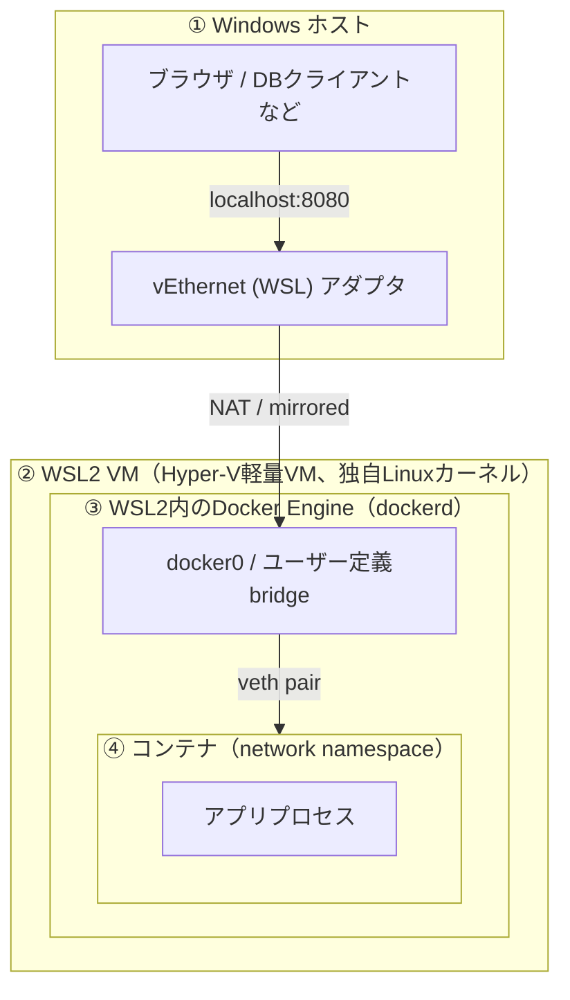

# 02 Windows・WSL2・Dockerの層構造

## 所要時間

約20分

## 学習目標

- Windows・WSL2 VM・Docker Engine・コンテナの4層構造を図で説明できる
- 各層が何を管理しているかを説明できる

---

## 4層構造の全体像

前のレッスンで学んだnetwork namespace/bridge/veth pairは、すべて「WSL2 VM内のLinux」の中で完結する話です。ここに「Windowsホスト」という、もう1つの層が加わることで、本教材特有の複雑さが生まれます。

全体像を図にすると、以下の4層構造になります。

## 各層の役割

| 層 | 何が動いているか | 誰が管理しているか |
|---|---|---|
| ① Windows ホスト | ブラウザ、DBクライアントなど、開発者が直接触るアプリケーション。`vEthernet (WSL)`という仮想ネットワークアダプタもここにある | Windows OS |
| ② WSL2 VM | Hyper-Vベースの軽量VM上で動く、本物のLinuxカーネル。01章・02章で扱った"WSL2そのもの" | Windows側のWSLサブシステム |
| ③ WSL2内のDocker Engine | `dockerd`（Dockerデーモン）。②のLinuxカーネル上で動く1つのアプリケーションに過ぎない | Docker Engine（02章でインストールしたもの） |
| ④ コンテナ | `dockerd`が作成したnetwork namespace上で動くアプリケーションプロセス | Docker Engineが管理、実体は②のLinuxカーネルのnamespace機能 |

⚠️ ここで重要なのは、**③のDocker Engineは②のWSL2 VM（1つのLinuxマシン）の中の1アプリケーションに過ぎない**という点です。Docker自体は「Windowsを知らない」し、「Windowsのネットワークを直接操作する権限も持たない」。DockerができるのはあくまでWSL2 VM内のLinuxネットワーク（②の中の話）を組み立てることだけです。

つまり、「Windows側からコンテナに繋がる」という体験を実現しているのは、Dockerではなく **①と②の間、つまりWSL自体が提供する橋渡しの仕組み**です。この仕組みを次のレッスンで詳しく見ていきます。

## なぜ層構造として理解する必要があるか

「Windows側からlocalhost:8080に繋がらない」というトラブルが起きたとき、原因は①〜④のどの層にもあり得ます。

- ④コンテナ自体が起動していない、またはクラッシュしている
- ③Docker Engineのポート公開設定（`-p`オプション）が間違っている
- ②WSL2 VM自体が古いネットワーク状態のまま残っている
- ①Windows側のvEthernetアダプタや他のソフトウェア（VPNなど）が競合している

どの層で問題が起きているかを切り分けられるようになることが、[06-network-troubleshooting.md](./06-network-troubleshooting.md) のゴールです。まずは③と④の内部（Dockerブリッジネットワーク）、次に①と②の間（WSL2のネットワークモード）を順に理解していきます。

## 章末チェックリスト

- [ ] Windows・WSL2 VM・Docker Engine・コンテナの4層構造を図なしで説明できる
- [ ] Docker Engineが「WSL2 VMの中の1アプリケーションに過ぎない」ことを説明できる

## 次へ

- [03-wsl2-network-modes.md](./03-wsl2-network-modes.md)
