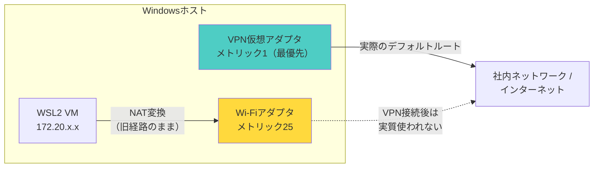

# 03 WSL2自体のネットワーク方式

## 所要時間

約25分

## 学習目標

- NATモードとmirrored networking modeの違いを説明できる
- `vEthernet (WSL)`アダプタとlocalhostフォワーディングの役割を説明できる
- ネットワークモードを切り替えられる

---

## NATモード（既定）

前のレッスンで見た①Windowsホストと②WSL2 VMの間は、既定では **NAT（Network Address Translation）モード**で繋がっています。

WSL2 VMは、Windowsホストから見ると別のネットワークセグメントに属する、独立したIPアドレスを持ちます。Windows側には`vEthernet (WSL)`という仮想ネットワークアダプタが作られ、これがWSL2 VMとの通信窓口になります。

## WSL2 VMのIPアドレスを確認する

WSL（Ubuntu）側で実行します。

```bash
ip addr show eth0
```

```
2: eth0: <BROADCAST,MULTICAST,UP,LOWER_UP> mtu 1500 ...
    inet 172.20.144.5/20 brd 172.20.159.255 scope global eth0
```

または、より簡潔に:

```bash
hostname -I
```

⚠️ このIPアドレス（例: `172.20.144.5`）は、**WSLを再起動する（`wsl --shutdown`する）たびに変わる可能性があります**。固定IPとして扱ってはいけません。

## 複数ディストロ間でのIP共有

01章で学んだ通り、Ubuntu・Debianなど複数のディストロは共通の1つのWSL2 VMを共有しています。ここで確認した`eth0`のIPアドレスは、**特定のディストロにではなく、そのVM全体に対して1つ**割り当てられているものです。

つまり、Ubuntu側とDebian側で`eth0`を確認すると、実は**同じIPアドレス**が表示されます。これは両者が同じネットワークインターフェースを見ているためです。

この事実には、次のような実務上の注意点があります。

⚠️ **複数ディストロで同時に同じポート番号をlistenすることはできません。** 例えばUbuntu側で`docker run -p 8080:80 nginx`を実行した状態で、Debian側でも別のプロセスに`8080`番をbindしようとすると、ポート競合が発生します。どちらのディストロで実行しているかに関わらず、ポート番号はVM全体で1つの名前空間を共有していると考えてください。

## localhostフォワーディングの仕組み

「IPアドレスが毎回変わるなら、Windows側からどうやって毎回同じ`http://localhost:8080`でアクセスできるのか」という疑問が浮かびます。

これを解決しているのが、WSL専用の **localhostフォワーディング** という機能です。Windows側で`localhost`（または`127.0.0.1`）宛にアクセスすると、WSLの仕組みが自動的にそれをWSL2 VM内の同じポート番号に転送してくれます。これにより、利用者はWSL2 VMの実際のIPアドレスを意識する必要がありません。

この機能があるからこそ、03章の演習で`docker run -p 8080:80`したコンテナに、Windows側から`localhost:8080`でアクセスできたのです。

⚠️ **ポート番号の名前空間は実質的に共有されます。** localhostフォワーディングは、WSL2内でポートをlistenするプロセスが現れるたびに、Windows側にも同じポート番号を待ち受ける中継役を作る仕組みです。そのため、Windows側のアプリとWSL2側のアプリが同じポート番号を使おうとすると、**先にそのポートを掴んだ側が勝つ**という早い者勝ちの競合が起こり得ます。

- WSL2側が先にそのポートをlistenしていた場合 → 後からWindows側の別アプリが同じポートを使おうとすると、Windows自身の通常のエラー（`address already in use`）になります
- Windows側のアプリが先にそのポートをlistenしていた場合 → 後からWSL2側でDockerコンテナなどを同じポートで起動しても転送先が作れず、`localhost:8080`は先に動いていたWindows側のアプリの方に繋がってしまいます（エラーにはならないため気づきにくい落とし穴です）

この現象が、07章の[パターン1: ポート競合](../07-operations-and-troubleshooting/03-common-failures-playbook.md)で「Windows側・WSL側の両方を確認する」必要がある理由です。

## mirrored networking mode（Windows 11 22H2+）

比較的新しい方式として、**mirrored networking mode**があります。これはWSL2 VMがWindowsホストと同じネットワークインターフェース・IPアドレス空間を「鏡写し」で共有する方式です。

主な導入目的は、企業VPN環境での接続性改善です。NATモードでは、VPNクライアントが仮想アダプタを追加することでWSLのNATと競合し、WSL側からインターネットに出られなくなる問題が知られています。mirrored modeではWSL2 VMがホストと同じネットワーク経路をそのまま使うため、この種の問題が起きにくくなります。

### なぜNATモードは企業VPN環境で問題を起こすのか

NATモードでは、WSL2からの外向き通信は、Windows側の通常のルーティングテーブルに従って「代表アダプタ」を経由してNAT変換されます。WSL2自身は、どの物理アダプタから出るべきかを知りません。

Cisco AnyConnectやGlobalProtectのような企業VPNクライアントは、接続時に仮想アダプタ（TAP/TUN）を追加し、多くの場合デフォルトルート（`0.0.0.0/0`）をこの仮想アダプタに最優先で切り替える「フルトンネル方式」で構成されています。例えば、VPN接続の前後でWindows側の経路情報（`route print`相当）はおおよそ次のように変化します。

```
VPN接続前:
  0.0.0.0/0  → Wi-Fiアダプタ（メトリック 25）

VPN接続後:
  0.0.0.0/0  → VPN仮想アダプタ（メトリック 1）  ← 最優先に
  0.0.0.0/0  → Wi-Fiアダプタ（メトリック 25）   ← 存在はするが使われなくなる
```

この状態でも、WSL2からの通信は依然としてWi-Fiアダプタ経由でNAT変換されようとします。しかし実際にインターネットへ出られる経路はVPN仮想アダプタしか無くなっているため、**Windows自身は問題なく通信できるのに、WSL2だけがインターネットに出られなくなる**という食い違いが起こります。



さらに、多くのVPNクライアントは「トラフィックリーク防止」のためのフィルタドライバを備えており、`vEthernet (WSL)`のようなVPN接続前には存在しなかった見慣れないアダプタからの通信を、意図的に遮断することもあります。VPN接続時はDNSサーバーも社内DNSに切り替わることが多く、WSL側の名前解決設定がこの切り替えに追従できず、名前解決だけが失敗するケースもあります。

mirrored modeでは、WSL2 VMがホストと同じネットワーク経路をそのまま使うため、そもそも「WSL2専用の別経路」という概念自体が無くなります。VPN側から見てもWSL2の通信はホスト自身の通信と区別がつかなくなるため、上記のような問題が構造的に起きにくくなります。

## モードの切り替え方

`%UserProfile%\.wslconfig` に以下を追記します。

```ini
[wsl2]
networkingMode=mirrored
```

設定後、Windows側PowerShellで以下を実行して反映させます。

```powershell
wsl --shutdown
```

💡 `wsl --shutdown`は終了処理のみで、設定を読み込み直す処理自体は含まれていません。VMを一度壊し、次回起動時にゼロから作り直させることで新しい`networkingMode`が反映される、という仕組みは [02-environment-setup/01-install-wsl.md](../02-environment-setup/01-install-wsl.md) で詳しく説明しています。

## 2つのモードの違いが与える影響

| 観点 | NATモード（既定） | mirrored networking mode |
|---|---|---|
| WSL2 VMのIP | Windowsホストとは別セグメント、再起動で変わりうる | Windowsホストと同じネットワーク空間を共有 |
| Windows↔WSL2の到達性 | localhostフォワーディング経由 | 直接到達（同じネットワークとして見える） |
| localhost転送の必要性 | 必要（自動で行われる） | モード自体が既に統合されているため意識不要な場面が増える |
| 既知の制約 | 企業VPN環境で疎通不可になることがある | 対応Windowsバージョン（Windows 11 22H2以降）が必要、一部の環境で挙動が異なる場合がある |

## 演習

1. `ip addr show eth0` を実行し、現在のWSL2 VMのIPアドレスを確認する
2. Windows側PowerShellで `wsl --shutdown` を実行し、再度ターミナルを開いて `ip addr show eth0` の出力を比較する（IPアドレスが変わっているか確認する）
3. （任意）`.wslconfig`に`networkingMode=mirrored`を設定し、`wsl --shutdown`後にネットワークの見え方がどう変わるか確認する
4. （複数ディストロをインストールしている場合）両方のディストロで`ip addr show eth0`を実行し、同じIPアドレスが表示されることを確認する

## 章末チェックリスト

- [ ] NATモードでWSL2 VMが独自のIPを持つことを説明できる
- [ ] localhostフォワーディングの役割を説明できる
- [ ] NATモードがVPN環境で問題を起こす理由（デフォルトルートの奪い合い）を説明できる
- [ ] mirrored networking modeがこの問題を構造的に解決する理由を説明できる
- [ ] 複数ディストロが同じIPアドレス・ポート空間を共有していることを説明できる

## 次へ

- [04-docker-bridge-networking.md](./04-docker-bridge-networking.md)
