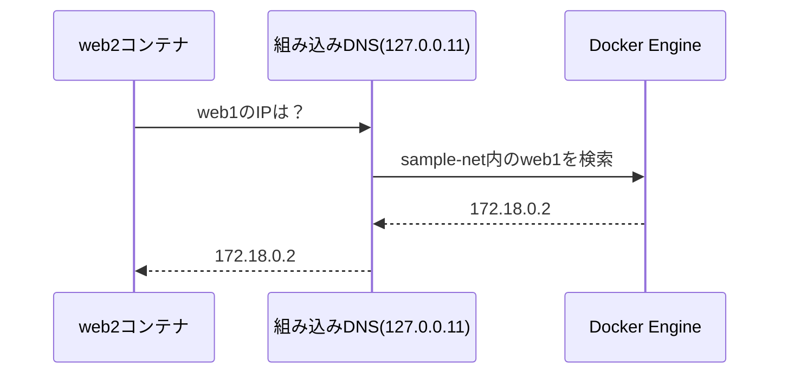

# 04 Dockerブリッジネットワークの内部構造

## 所要時間

約25分

## 学習目標

- `docker0`ブリッジとユーザー定義bridgeの違いを説明できる
- `docker network inspect`でネットワークの内部構造を読める
- WSL2 VM内にbridgeインターフェースが実在することを確認できる

---

## docker0ブリッジ

Docker Engineをインストールすると、既定の`bridge`ネットワークの実体として`docker0`という名前の仮想ブリッジが自動的に作られます。これはWSL2 VM（②の層）の中に存在する、通常のLinuxネットワークインターフェースです。

```bash
ip addr show docker0
```

```
3: docker0: <NO-CARRIER,BROADCAST,MULTICAST,UP> mtu 1500 ...
    inet 172.17.0.1/16 brd 172.17.255.255 scope global docker0
```

## コンテナへのIP割当

コンテナを起動すると、そのコンテナのnetwork namespaceにveth pairの片割れが挿入され、`docker0`（または指定したネットワーク）のサブネットからIPアドレスが1つ割り当てられます。

```bash
docker run -d --name web nginx
docker inspect web --format '{{.NetworkSettings.IPAddress}}'
```

```
172.17.0.2
```

## ユーザー定義bridgeを推奨する理由

既定の`bridge`（`docker0`）に接続したコンテナ同士は、IPアドレスでは通信できますが、**コンテナ名による名前解決ができません**。これに対し、`docker network create`で作成したユーザー定義bridgeには、DockerEngine内蔵のDNS機能が有効になっており、コンテナ名で名前解決できます。

これは03章の演習（`docker network create sample-net`でping確認した内容）の裏側にある仕組みです。実務では、複数コンテナを連携させる場合は必ずユーザー定義bridgeを使うことが推奨されます（06章のCompose章でも、この仕組みが標準で使われます）。

### なぜコンテナ名で名前解決できるのか

ユーザー定義bridgeに接続したコンテナには、Docker Engineが自動的にDNSサーバーの設定を書き込みます。

```bash
docker exec web2 cat /etc/resolv.conf
```

```
nameserver 127.0.0.11
options ndots:0
```

`127.0.0.11`は、Docker Engineがコンテナごとに用意する**組み込みDNSサーバー（embedded DNS server）**のアドレスです。コンテナが`web1`のような名前を解決しようとすると、まずこの`127.0.0.11:53`に問い合わせが飛びます。Docker Engineは、同じユーザー定義ネットワークに接続されている他のコンテナの「コンテナ名 → 現在のIPアドレス」対応表を内部で管理しており、この問い合わせに応答します。

```bash
docker exec web2 nslookup web1
```

```
Server:    127.0.0.11
Address:   127.0.0.11:53

Name:   web1
Address: 172.18.0.2
```

この問い合わせの流れを図にすると以下のようになります。



⚠️ 既定の`bridge`（`docker0`）にはこの組み込みDNSサーバーが設定されません。古い方式である`/etc/hosts`への静的な追記のみに頼るため、コンテナを再作成してIPが変わると追従できず、事実上コンテナ名での通信ができません。これがユーザー定義bridgeとの決定的な違いです。

## docker network inspectで見る内部構造

```bash
docker network create sample-net
docker run -d --name web --network sample-net nginx
docker network inspect sample-net
```

```json
[
    {
        "Name": "sample-net",
        "Driver": "bridge",
        "IPAM": {
            "Config": [
                {
                    "Subnet": "172.18.0.0/16",
                    "Gateway": "172.18.0.1"
                }
            ]
        },
        "Containers": {
            "a1b2c3...": {
                "Name": "web",
                "IPv4Address": "172.18.0.2/16"
            }
        }
    }
]
```

- `Driver` — このネットワークが使うドライバ。`--driver`を指定せずに作成しても既定で`bridge`になります（03章のコラム参照）
- `IPAM.Config` — このネットワークに割り当てられたサブネットとゲートウェイ
- `Containers` — 現在このネットワークに接続しているコンテナと、それぞれのIPアドレス

## ホスト側から見たbridgeの実体

WSL2 VM（②の層）はれっきとした1つのLinuxマシンです。そのため、Dockerが作ったbridgeは、通常のLinuxネットワーク管理コマンドでそのまま確認できます。

```bash
ip addr show
ip link show type bridge
```

`docker0`に加えて、`br-`から始まるユーザー定義ネットワーク用のインターフェースも見えるはずです。これは、02章で学んだ「WSL2 VMは本物のLinuxカーネルを持つ」という事実の裏付けでもあります。

⚠️ **`br-`は「コンテナ1つにつき1つ」ではなく「ユーザー定義ネットワーク1つにつき1つ」です。** 命名規則は`br-<ネットワークIDの先頭12桁>`で、そのネットワークIDは`docker network inspect sample-net --format '{{.Id}}'`で確認できます。

```bash
docker network inspect sample-net --format '{{.Id}}'
```

```
a1b2c3d4e5f6...（64桁）
```

この先頭12文字が、`ip link show type bridge`で見える`br-a1b2c3d4e5f6`と一致します。1つのユーザー定義ネットワーク（＝1つの`br-...`）に、`web`・`web2`のような複数のコンテナがそれぞれveth pairで接続する、という関係です（01章の[container-network-concepts.md](./01-container-network-concepts.md)の図の通り）。

## 演習

1. `docker network create sample-net` でユーザー定義bridgeを作成する
2. コンテナを1つ起動して接続し、`docker network inspect sample-net`でIPアドレスを確認する
3. `docker exec`でコンテナ内の`/etc/resolv.conf`を確認し、`nameserver 127.0.0.11`が設定されていることを確認する
4. WSL側で `ip link show type bridge` を実行し、`docker0`と`br-`で始まるインターフェースの両方が存在することを確認する
5. `docker network inspect sample-net --format '{{.Id}}'`の先頭12文字が、`ip link show type bridge`で見える`br-...`のインターフェース名と一致することを確認する

## 章末チェックリスト

- [ ] `docker0`がWSL2 VM内の通常のLinuxブリッジであることを説明できる
- [ ] 既定bridgeとユーザー定義bridgeで名前解決の可否が違う理由を説明できる
- [ ] コンテナ名の名前解決が`127.0.0.11`の組み込みDNSサーバーによるものであることを説明できる
- [ ] `br-`インターフェースが「コンテナ1つ」ではなく「ネットワーク1つ」に対応することを説明できる
- [ ] `docker network inspect`の出力からサブネットとコンテナIPを読み取れる

## 次へ

- [05-port-publishing-path.md](./05-port-publishing-path.md)
