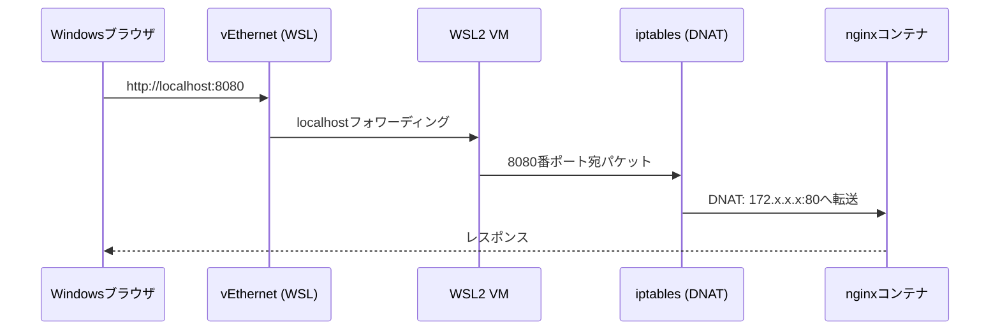

# 05 ポート公開（-p）の実経路

## 所要時間

約25分

## 学習目標

- `-p`オプションがiptablesのDNATルールを作ることを理解する
- Windowsブラウザからコンテナまでパケットが辿る経路を層ごとに説明できる
- 各層で疎通確認するコマンドを使い分けられる

---

## -p オプションが作るiptables NATルール

03章で使った`docker run -d --name web -p 8080:80 nginx`を例にします。Docker Engineは`-p 8080:80`を指定すると、WSL2 VM（②の層）の`iptables`に、8080番ポート宛のパケットをコンテナのIP:80番に転送する**DNAT（Destination NAT）ルール**を自動的に追加します。

実際に確認してみましょう。

```bash
docker run -d --name web -p 8080:80 nginx
sudo iptables -t nat -L DOCKER -n
```

```
Chain DOCKER (2 references)
target     prot opt source               destination
DNAT       tcp  --  0.0.0.0/0            0.0.0.0/0            tcp dpt:8080 to:172.17.0.2:80
```

`dpt:8080`宛のパケットが`172.17.0.2:80`（コンテナのIP）に転送される、というルールがそのまま見えます。

## パケットが辿る経路の全体図



1. Windowsブラウザが`http://localhost:8080`にリクエストを送る
2. `vEthernet (WSL)`アダプタが、WSL専用のlocalhostフォワーディング機能でWSL2 VMに転送する（03章参照）
3. WSL2 VM内で8080番ポート宛に届いたパケットを、`iptables`のDNATルールが`172.x.x.x:80`（コンテナのIP:ポート）に書き換える
4. コンテナ内のnginxプロセスがリクエストを受け取り、レスポンスを返す

## 各層での確認コマンド一覧

トラブルが起きたとき、この表の上から順に確認することで、どの層まで到達しているかを切り分けられます。

| 層              | 確認コマンド                                               | 期待する結果                                                                   |
| --------------- | ---------------------------------------------------------- | ------------------------------------------------------------------------------ |
| ①Windows       | `curl http://localhost:8080`（PowerShellまたはブラウザ） | nginxの応答が返る                                                              |
| ①→②          | —                                                         | ①が失敗し②が成功する場合、localhostフォワーディングかvEthernetアダプタの問題 |
| ②WSL2 VM       | `curl http://localhost:8080`（WSLターミナル内）          | nginxの応答が返る                                                              |
| ③Docker Engine | `docker ps` でSTATUSが`Up`か確認                       | コンテナが起動中である                                                         |
| ④コンテナ内    | `docker exec web curl http://localhost:80`               | コンテナ内部でアプリ自体が正常に応答する                                       |

## 演習

1. `docker run -d --name web -p 8080:80 nginx` でコンテナを起動する
2. `sudo iptables -t nat -L DOCKER -n` を実行し、DNATルールが追加されていることを確認する
3. 上記の表にある4つの確認コマンドを順番に実行し、すべて成功することを確認する
4. `docker rm -f web` でコンテナを削除した直後にもう一度`sudo iptables -t nat -L DOCKER -n`を実行し、DNATルールが自動的に消えていることを確認する

## 章末チェックリスト

- [ ] `-p`オプションがiptablesのDNATルールを作ることを説明できる
- [ ] Windowsブラウザからコンテナまでの経路を4段階で説明できる
- [ ] 表の4つの確認コマンドをそれぞれどの層の確認に使うか説明できる

## 次へ

- [06-network-troubleshooting.md](./06-network-troubleshooting.md)
