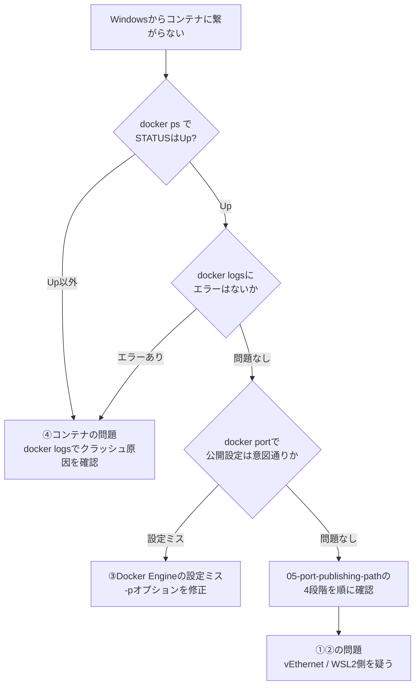

# 06 ネットワークのトラブルシューティング

## 所要時間

約20分

## 学習目標

- 層構造に沿った切り分け手順を実践できる
- 典型的な5つの障害パターンの原因を説明できる

---

## トラブルシュートの基本方針

[02-layered-architecture.md](./02-layered-architecture.md) で学んだ①Windows／②WSL2 VM／③Docker Engine／④コンテナの4層構造を、**④→③→②→①の順（内側から外側へ）**、または**①→②→③→④の順（外側から内側へ）**で切り分けます。どちらから始めても構いませんが、途中で切り分けを飛ばさないことが重要です。

## 典型パターン1: コンテナは起動しているのにWindowsから繋がらない

1. `docker ps` で対象コンテナのSTATUSを確認する。`Up`になっていない場合は④の問題
2. `docker logs <container>` でアプリ自体がクラッシュしていないか確認する
3. `docker port <container>` で`-p`オプションによるポート公開設定が意図通りか確認する（指定漏れ・ポート番号の書き間違いが典型的な原因）
4. 上記すべて問題なければ、[05-port-publishing-path.md](./05-port-publishing-path.md) の確認コマンド一覧を上から順に実行し、①〜④のどこで途切れているか特定する

この切り分け手順を図にすると以下のようになります。

## 典型パターン2: WSL再起動後に繋がらなくなった

- [03-wsl2-network-modes.md](./03-wsl2-network-modes.md) で学んだ通り、NATモードではWSL2 VMのIPアドレスがWSL再起動のたびに変わりえます。ただし、localhostフォワーディングがある限り、これ自体は`localhost`でのアクセスに影響しません
- むしろ多くの場合、原因はDockerデーモンが自動起動していないことです。02章のパターンA（都度起動）を選んでいる場合、`wsl --shutdown`後は`sudo service docker start`を再実行する必要があります
- `docker ps`が`Cannot connect to the Docker daemon`というエラーを返す場合は、この可能性が高いです

## 典型パターン3: 企業VPN接続中にWSLからインターネットに出られない

- VPNクライアントが仮想ネットワークアダプタを追加し、その優先順位がWSLのNAT用アダプタ（`vEthernet (WSL)`）と競合することで発生する既知の問題です
- [03-wsl2-network-modes.md](./03-wsl2-network-modes.md) で紹介した`mirrored`ネットワークモードへの切り替えが有効な場合があります
- 社内プロキシ証明書自体が原因のケースもあります。この場合の恒久対応（プロキシ設定・証明書配置）は [08-security-and-enterprise-network](../08-security-and-enterprise-network/README.md) で扱います

## 典型パターン4: コンテナ同士が名前解決できない

- [04-docker-bridge-networking.md](./04-docker-bridge-networking.md) で学んだ通り、既定の`bridge`ネットワーク（`docker0`）に接続したコンテナ同士は名前解決ができません
- `docker inspect <container> --format '{{.NetworkSettings.Networks}}'` で、対象コンテナがどのネットワークに接続されているか確認する
- 既定bridgeを使っている場合は、`docker network create`でユーザー定義bridgeを作り、コンテナを接続し直すことで解決します（06章のComposeでは標準でこの構成になります）

## 典型パターン5: 複数ディストロで同じポートが競合する

- [03-wsl2-network-modes.md](./03-wsl2-network-modes.md) で学んだ通り、複数のディストロは同じWSL2 VM・同じ`eth0`を共有しています。あるディストロ（例: Ubuntu）でコンテナが`-p 8080:80`を使っている状態で、別のディストロ（例: Debian）側でも`8080`番を使おうとすると、`bind: address already in use`のようなエラーになります
- これは01章で学んだ「複数ディストロは1つのVMを共有する」という事実の、ネットワーク面での現れです。**コンテナがどのディストロで動いているか**を意識せず、ポート番号を「VM全体で1つの名前空間」として管理する必要があります
- 対処法は07章の[パターン1: ポート競合](../07-operations-and-troubleshooting/03-common-failures-playbook.md)と同じで、`sudo ss -tulpn | grep <port>`をそれぞれのディストロで確認し、どちらが専有しているかを特定します

## 章末チェックリスト

- [ ] パターン1〜5それぞれについて、どの層が原因かを説明できる
- [ ] `docker logs`, `docker port`, `docker inspect`を使った切り分けができる
- [ ] mirroredモードが有効な状況を説明できる
- [ ] 複数ディストロ間のポート競合が起きる理由を説明できる

## 次へ

- [05-dev-workflow-and-file-sharing/README.md](../05-dev-workflow-and-file-sharing/README.md)
