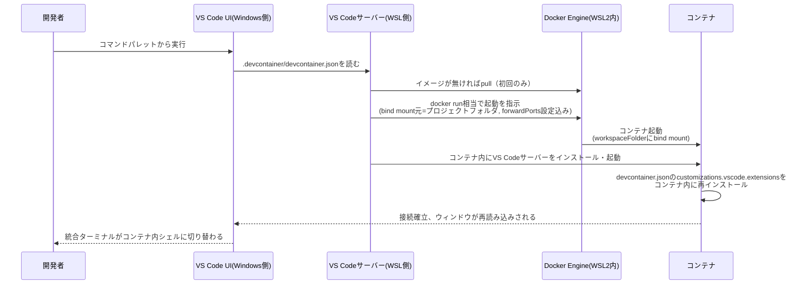
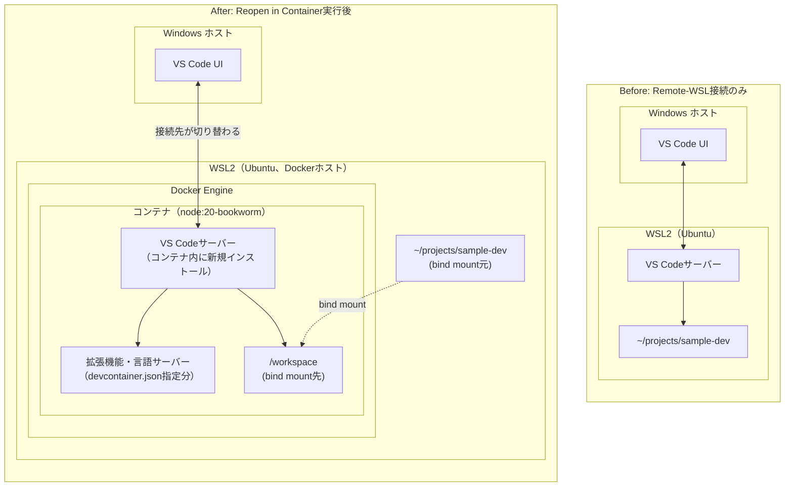
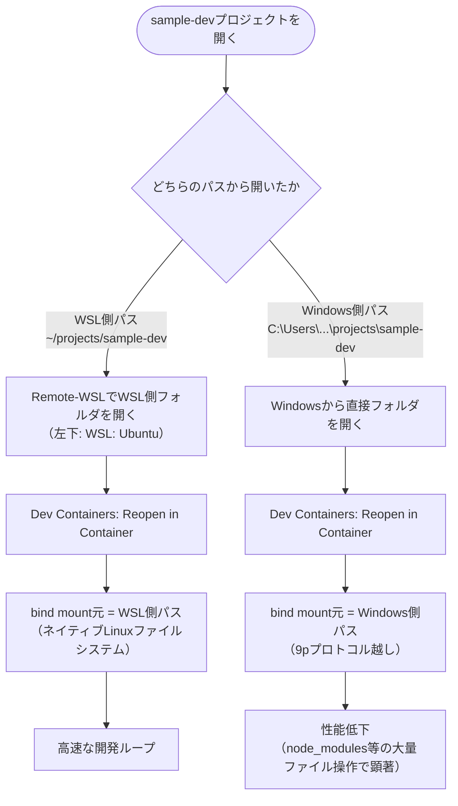

# 03 VS Code Dev Containersでの開発ループ

## 所要時間

約25分

## 学習目標

- Dev Containersを利用するメリットを説明できる
- devcontainer.jsonの最小構成を作成できる
- Dev Containersでコンテナ内開発を起動できる
- Remote-WSLとの組み合わせで高速な開発ループを構築できる

---

## Dev Containersとは

Dev Containersは、プロジェクトに`.devcontainer/devcontainer.json`を置くことで、VS Code自体をコンテナ内で動かし、拡張機能・ターミナル・デバッガまで含めてコンテナ内の環境で開発できるようにする仕組みです（02章でインストール済みの拡張機能を使用します）。

## Dev Containersを利用するメリット

- **環境の再現性・一貫性**: OS・ランタイムバージョン・インストール済みツールを`devcontainer.json`（必要なら`Dockerfile`）にコードとして記述できるため、「自分の環境では動くのに他の人では動かない」という問題を解消できる。リポジトリをクローンして`Reopen in Container`するだけで、チーム全員が同じ環境を再現できる
- **ホスト環境を汚さない**: Node.jsやPython、DBクライアントなどをWindows/WSL側に直接インストールする必要がない。プロジェクトAは`node:18`、プロジェクトBは`node:20`のように、バージョン管理ツール（nvm等）なしで複数バージョンを共存させられる
- **オンボーディングの高速化**: READMEのセットアップ手順を一つずつ実行する代わりに、クローンして`Reopen in Container`を叩くだけで開発を始められる
- **拡張機能もプロジェクト単位で分離**: `devcontainer.json`の`customizations.vscode.extensions`で、そのプロジェクトに必要な拡張機能だけをコンテナ内にインストールできる。無関係な拡張機能が競合したり動作を阻害したりしない
- **本番・CI環境に近づけられる**: ベースイメージをCI/本番と揃えれば、開発環境と本番環境の差分を減らせる
- **WSL2 + Remote-WSLとの組み合わせ**: Remote-WSLでWSL側のネイティブファイルシステムを経由してからDev Containersを起動すれば、bind mountが高速な経路になり、開発ループを維持したまま上記すべてのメリットを得られる（詳細は本章「Remote-WSLとの関係」）

トレードオフとして、初回のイメージpull・コンテナビルドに時間がかかる点、コンテナ内外の行き来（ホストのGitクレデンシャルやSSH鍵の共有など）に多少の設定が必要な点は留意してください。

## 最小構成のdevcontainer.json

```bash
mkdir -p ~/projects/sample-dev/.devcontainer
```

`~/projects/sample-dev/.devcontainer/devcontainer.json`:

```json
{
  "name": "sample-dev",
  "image": "node:20-bookworm",
  "workspaceFolder": "/workspace",
  "forwardPorts": [3000]
}
```

- `image`: ベースとなるDockerイメージ
- `workspaceFolder`: コンテナ内でプロジェクトを配置するパス
- `forwardPorts`: コンテナ内で使うポートをホスト側にも自動転送する設定（04章で学んだ`-p`相当をVS Codeが自動で行う）

## OS・ランタイム・ツールをコードとして記述する

前節の「環境の再現性」は、`devcontainer.json`（および必要に応じて組み合わせる`Dockerfile`）に、次の3種類の要素を設定ファイルとして書き下せることで実現されています。

**OS・ランタイムバージョン**: `image`にタグ付きのDockerイメージを指定するだけで確定します（上の最小構成例がまさにこれです）。既存イメージでは足りない場合は、独自の`Dockerfile`をビルドして使うこともできます。

```json
{
  "build": {
    "dockerfile": "Dockerfile"
  }
}
```

```dockerfile
FROM node:20-bookworm
RUN apt-get update && apt-get install -y postgresql-client
```

**インストール済みツール**: 主に2通りの方法があります。

- **Dev Container Features**: Git・AWS CLI・Docker-in-Dockerなど、よく使うツールセットを宣言的に追加できる公式カタログ機能

  ```json
  {
    "features": {
      "ghcr.io/devcontainers/features/git:1": {},
      "ghcr.io/devcontainers/features/docker-in-docker:2": {}
    }
  }
  ```

- **`postCreateCommand`**: コンテナ作成直後に一度だけ実行されるコマンド。依存パッケージのインストールなど、イメージに焼き込むほどではない初期化処理に使う

  ```json
  {
    "postCreateCommand": "npm install"
  }
  ```

これらはすべてプロジェクトのGitリポジトリにテキストファイルとしてコミットされます。従来なら「READMEに手順を書く」形で口頭伝承やドキュメントに依存していた環境構築の知識が、`devcontainer.json`/`Dockerfile`という実行可能な設定ファイルに置き換わることで、`git diff`で変更内容をレビューでき、`git log`で変更理由を追跡でき、クローンするだけで環境の定義そのものが手に入る、という通常のアプリケーションコードと同じ管理方法を開発環境自体にも適用できます。

## 起動確認

1. Remote-WSL拡張で `~/projects/sample-dev` をVS Codeで開く
2. コマンドパレット（`Ctrl+Shift+P`）から `Dev Containers: Reopen in Container` を実行する
3. 初回はイメージのpullとコンテナの起動が行われ、しばらく待つと統合ターミナルが開く

統合ターミナルで以下を実行し、コンテナ内のシェルであることを確認します。

```bash
node --version
cat /etc/os-release
```

Node.jsのバージョンが`devcontainer.json`で指定した`20`系であること、OSがコンテナのベースイメージ（Debian bookworm）であることを確認します。

## Reopen in Containerで内部的に何が起きるか

`Dev Containers: Reopen in Container`を実行すると、裏では次の処理が順に走ります。



ポイントは、**VS Codeサーバーがもう一段ネストする**ことです。02章で説明した通り、Remote-WSL接続の時点で既にWSL側にVS Codeサーバーが1つ動いていますが、Reopen in Containerを実行すると**コンテナ内にさらに別のVS Codeサーバーが新規インストールされ**、UIの接続先がWSL側サーバーからコンテナ内サーバーへ切り替わります。拡張機能も、この時点で「コンテナ用」が改めてインストールされます（Windows用・WSL用とは別の3つ目のインストール先になります）。

構成がどう変わるかを、実行前後で比較すると次のようになります。



Beforeでは「Windows UI ↔ WSL側サーバー」という1段の接続でしたが、Afterでは「Windows UI ↔ コンテナ内サーバー」に置き換わり、WSL自体は「Dockerホスト」としての役割に退きます。プロジェクトフォルダの実体（`~/projects/sample-dev`）はWSL側に残ったままで、コンテナの`/workspace`へbind mountされる、という点は変わりません（このbind mount元がWSL側パスかWindows側パスかで速度が変わる、というのが次節の内容です）。

## Remote-WSLとの関係

Dev Containersは、bind mount元としてプロジェクトフォルダをそのままコンテナに接続します。前のレッスンで学んだ通り、**Remote-WSLでWSL内フォルダ（`~/projects/sample-dev`）を開いた状態からDev Containersを起動すると、bind mount元がWSL側パスになり、高速な経路で開発できます**。

逆に、Windows側のフォルダ（`C:\Users\...\projects\sample-dev`）を直接開いてDev Containersを起動すると、bind mount元がWindows側パスになり、性能低下の原因になります。**必ずRemote-WSLでWSL側フォルダを開いてからDev Containersを起動する**、という順序を徹底してください。



同じ`Dev Containers: Reopen in Container`という操作でも、**その直前にどちらのファイルシステムパスでフォルダを開いていたか**によって、bind mount元がまるごと変わってしまう点に注意してください。

## 演習

1. `sample-dev`プロジェクトを作成し、Remote-WSLでWSL側フォルダとして開く
2. `Dev Containers: Reopen in Container`でコンテナ内開発環境を起動する
3. 統合ターミナルでコンテナ内であることを確認する

## 章末チェックリスト

- [ ] Dev Containersを利用するメリットを説明できる
- [ ] `devcontainer.json`の最小構成を作成できた
- [ ] `features`や`postCreateCommand`、独自`Dockerfile`でツール・OS/ランタイムをコードとして記述する方法を説明できる
- [ ] Dev Containersでコンテナ内開発環境を起動できた
- [ ] Reopen in Container実行時にVS Codeサーバーの接続先がWSL側からコンテナ内へ切り替わる仕組みを説明できる
- [ ] Remote-WSL経由で開くことの重要性を説明できる

## 次へ

- [04-line-endings-and-git.md](./04-line-endings-and-git.md)
