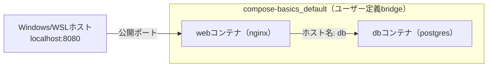

# 02 Composeのネットワークとサービス発見

## 所要時間

約15分

## 学習目標

- Composeが自動でユーザー定義bridgeを作ることを理解する
- サービス名がそのままホスト名になる仕組みを説明できる

---

## Composeは自動でユーザー定義bridgeを作る

04章で「既定bridgeでは名前解決ができないが、ユーザー定義bridgeならDNSで名前解決できる」と学びました。Docker Composeは、プロジェクトごとに`<プロジェクト名>_default`というユーザー定義bridgeネットワークを**自動的に**作成します。つまり、Composeを使う限り、意識せずとも常にユーザー定義bridgeの恩恵（名前解決）を受けられます。

## service名がそのままホスト名になる

```yaml
services:
  web:
    image: nginx:latest
    ports:
      - "8080:80"
  db:
    image: postgres:16
    environment:
      POSTGRES_PASSWORD: example
```

この構成では、`web`サービスのコンテナ内から`db`というホスト名（サービス名そのもの）で`db`サービスに接続できます。

```bash
docker compose exec web bash
apt-get update && apt-get install -y iputils-ping
ping db
```

IPアドレスを一切指定していないのに、サービス名だけで通信できることが確認できます。

この構成を図にすると以下のようになります。



ホストから到達できるのは公開ポートを設定した`web`だけで、`db`はネットワーク内部からしか到達できません。これはComposeを使わずに03章・04章で自分で`docker network create`していた構成と同じで、Composeがネットワーク作成とサービス接続を自動化しているだけです。

## docker network inspectで確認

04章で使ったコマンドを、Composeが自動作成したネットワークに対して実行してみます。

```bash
docker network ls
```

```
NETWORK ID     NAME                    DRIVER    SCOPE
...            compose-basics_default   bridge    local
```

```bash
docker network inspect compose-basics_default
```

`Containers`欄に、`web`・`db`両方のコンテナと、それぞれのIPアドレスが表示されます。

## 演習

1. `web`と`db`の2サービス構成の`docker-compose.yml`を作る
2. `docker compose up -d`後、`docker compose exec web ping db`でサービス名による通信を確認する
3. `docker network inspect`で自動作成されたネットワークの内部構造を確認する

## 章末チェックリスト

- [ ] Composeが自動でユーザー定義bridgeを作ることを説明できる
- [ ] サービス名がそのままホスト名になることを確認できた

## 次へ

- [03-web-db-example.md](./03-web-db-example.md)
