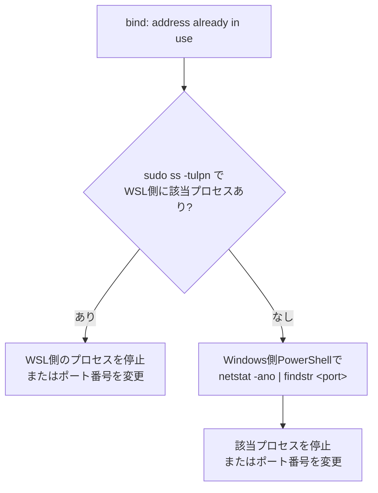

# 03 よくある障害のトラブルシューティング

## 所要時間

約20分

## 学習目標

- ネットワーク以外の典型的な4つの障害パターンに対処できる

---

⚠️ ネットワーク起因のトラブル（「Windowsから繋がらない」等）は [04-networking-deep-dive/06-network-troubleshooting.md](../04-networking-deep-dive/06-network-troubleshooting.md) で扱っています。この章ではそれ以外の障害を扱います。

## パターン1: ポート競合

```
Error starting userland proxy: listen tcp4 0.0.0.0:8080: bind: address already in use
```

WSL側で何が8080番ポートを使っているか確認します。

```bash
sudo ss -tulpn | grep 8080
```

⚠️ **重要な注意点**: WSL側でポートを使っているプロセスが見つからない場合、犯人はWindows側にいる可能性があります。04章で学んだ層構造の通り、Windows側のプロセスがそのポートを専有していても、WSL側からは直接見えません。Windows側PowerShellで確認します。

```powershell
netstat -ano | findstr 8080
```

該当プロセスを停止するか、コンテナ側のポート番号を変更して回避します。



## パターン2: ディスク容量不足

WSL2は仮想ディスクファイル（`ext4.vhdx`）を使っており、これは一度肥大化すると`docker system prune`しても自動的には縮小されません。

### なぜ自動的に縮小されないのか

`ext4.vhdx`は「可変長（dynamically expanding）」の仮想ディスクです。中身のデータが増えるとWindows側のファイルサイズも一緒に伸びていきますが、**逆方向（データを消したときにファイルサイズを縮める処理）は自動では行われません**。

これは仮想ディスク全般に共通する性質です。WSL内で`docker system prune`によってファイルを削除しても、それは「ゲスト側（WSL2 VM内のext4ファイルシステム）で領域が未使用になった」ことを意味するだけで、その情報がホスト側の`vhdx`ファイルにまで伝わり、ファイル自体を縮小する処理（コンパクト化）は別途明示的に実行する必要があります。

```powershell
# ディストロ名の確認
wsl -l -v

# 対応バージョンの場合、コンパクト化を試みる
wsl --manage Ubuntu --compact
```

このオプションに対応していない古いWSLバージョンの場合は、`diskpart`を使った手動コンパクト化が必要になります（Microsoft公式ドキュメントの`ext4.vhdx`縮小手順を参照してください）。

## パターン3: コンテナがすぐ終了する（Exited (1)）

```bash
docker ps -a
```

```
CONTAINER ID   IMAGE     STATUS
a1b2c3d4e5f6   myimage   Exited (1) 3 seconds ago
```

最優先で確認すべきは`docker logs`です。

```bash
docker logs a1b2c3d4e5f6
```

典型的な原因は、フォアグラウンドで動き続けるプロセスが無いイメージ（例: `ENTRYPOINT`も`CMD`も設定されていないbaseイメージをそのまま起動した）です。コンテナはメインプロセスが終了すると同時に停止する、という基本仕様を思い出してください。

## パターン4: WSLが応答しなくなった

まず`wsl --shutdown`で再起動を試みます。

```powershell
wsl --shutdown
```

数秒待ってから、再度ターミナルを開きます。

⚠️ それでも改善しない場合の最終手段として`wsl --unregister <distro>`がありますが、**これは対象ディストロ内の全データを完全に削除します**。実行前に、named volumeのデータや設定ファイルなど、失って困るものがないか必ず確認してください。

```powershell
# 最終手段。全データが消えるため慎重に。
wsl --unregister Ubuntu
```

## 章末チェックリスト

- [ ] ポート競合時にWindows側・WSL側の両方を確認する必要があることを説明できる
- [ ] `ext4.vhdx`が自動縮小されない理由を、可変長仮想ディスクの性質から説明できる
- [ ] `docker logs`がコンテナ即終了トラブルの最優先確認事項であることを理解している
- [ ] `wsl --unregister`が最終手段でありデータが失われることを説明できる

## 次へ

- [08-security-and-enterprise-network/README.md](../08-security-and-enterprise-network/README.md)
