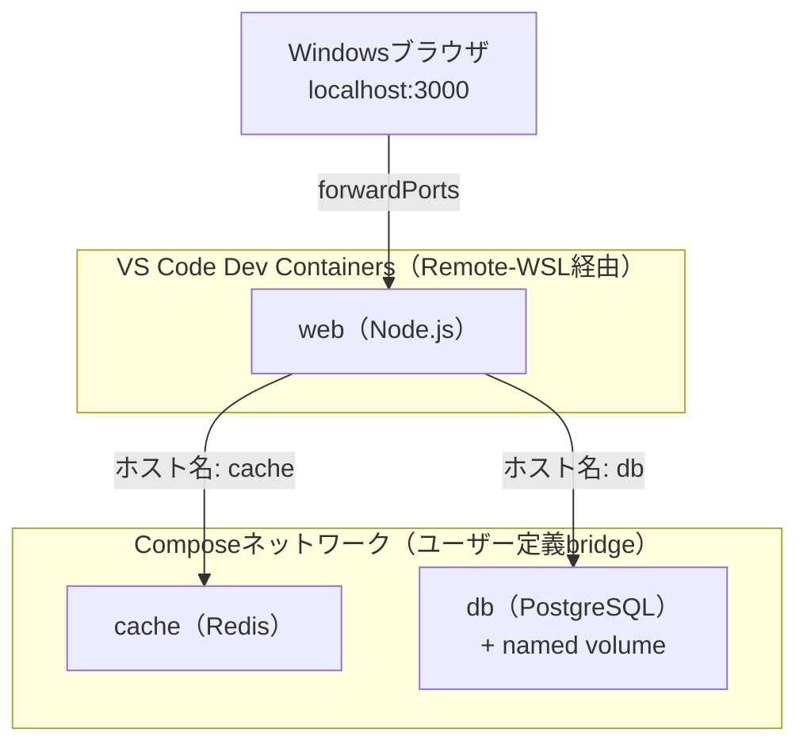

# 01 お題

## 所要時間

約10分

## 学習目標

- ここまでの学習内容を統合した実践課題の全体像を理解する

---

## お題

06章で作成したWeb + PostgreSQL構成に、Redisキャッシュサービスを追加した**3サービス構成**を、WSL2上でVS Code Dev Containersを使って開発します。

目指す全体構成は以下の通りです。

## 満たすべき要件

- [ ] Docker Composeで`web`・`db`・`cache`の3サービスが起動すること
- [ ] Windows側ブラウザから`web`サービスにアクセスできること
- [ ] `db`サービスのデータが、コンテナ再作成後も残ること（`docker compose down`で消えないこと）
- [ ] VS Code Dev Containersで`web`サービスのコードを直接編集・実行できること

## 使う技術要素の対応表

| 使う技術要素 | 対応する章 |
|---|---|
| WSL内Docker Engineでの動作環境 | 02章 |
| `docker-compose.yml`の基本構文 | 06章 |
| サービス名による名前解決（`db`, `cache`） | 04章・06章 |
| named volumeによるDBデータ永続化 | 03章 |
| bind mountをWSL側パスに置く | 05章 |
| `devcontainer.json`によるDev Containers構成 | 05章 |
| ポート公開の仕組みの理解（`forwardPorts`） | 04章 |

## 次へ

- [02-build-and-run.md](./02-build-and-run.md)
