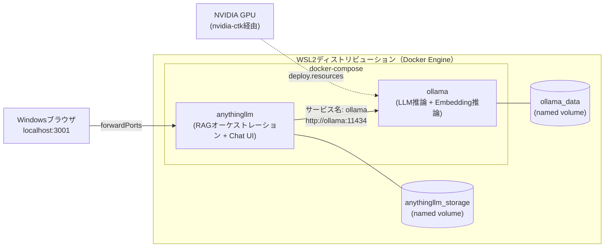
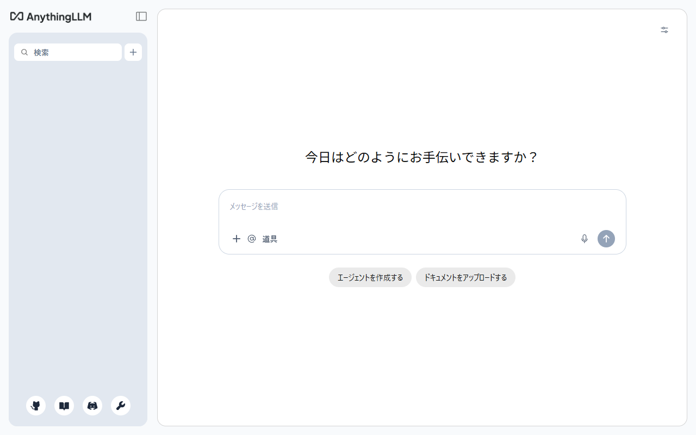

# 01 アーキテクチャとCompose構築

## 所要時間

約30分

## 学習目標

- AnythingLLM（RAGオーケストレーション + Chat UI）とOllama（ローカルLLM推論）の役割分担を説明できる
- docker-composeで両サービスを連携させて起動できる
- WSL2でのGPU passthroughの要否と設定方法を理解する

---

## 全体アーキテクチャ

Ollamaは「LLM推論エンジン」、AnythingLLMは「RAGオーケストレーション + Chat UI」という役割分担です。AnythingLLM自体は推論を行わず、Ollamaのapiにhttpでリクエストを投げるだけなので、06章で学んだComposeのサービス名解決がそのまま使えます。



- WSL/Dockerの基礎（[02章](../02-environment-setup/README.md)）・Compose構文とサービス名解決（[06章](../06-compose-multi-service/README.md)）・named volumeでの永続化（[03章](../03-docker-core-operations/README.md)）は、これまでの章の知識がそのまま使えます。
- モデルファイル（数GB〜十数GB）は`ollama_data`に、AnythingLLM側の設定・ベクトルDB・取り込んだドキュメントは`anythingllm_storage`に永続化されます。`docker compose down`だけならどちらも残ります。

## docker-compose.yml（GPUなし版）

まずはGPUなしで動作確認します。

```bash
mkdir -p ~/projects/local-rag && cd ~/projects/local-rag
```

`docker-compose.yml`:

```yaml
services:
  ollama:
    image: ollama/ollama:latest
    volumes:
      - ollama_data:/root/.ollama

  anythingllm:
    image: mintplexlabs/anythingllm:latest
    environment:
      - STORAGE_DIR=/app/server/storage
      - LLM_PROVIDER=ollama
      - OLLAMA_BASE_PATH=http://ollama:11434
      - EMBEDDING_ENGINE=ollama
      - EMBEDDING_BASE_PATH=http://ollama:11434
      - EMBEDDING_MODEL_PREF=qwen3-embedding:0.6b
    ports:
      - "3001:3001"
    volumes:
      - anythingllm_storage:/app/server/storage
    depends_on:
      - ollama

volumes:
  ollama_data:
  anythingllm_storage:
```

`OLLAMA_BASE_PATH`にはコンテナ名ではなくComposeの**サービス名**`ollama`を指定します。06章で学んだ通り、Composeが作るユーザー定義bridgeネットワーク上ではサービス名がそのままホスト名として名前解決されるためです。

### 各設定項目の説明

| 項目                        | 内容                                                                                                                                                                                                                                                         |
| --------------------------- | ------------------------------------------------------------------------------------------------------------------------------------------------------------------------------------------------------------------------------------------------------------ |
| `image`                   | Docker Hub上の公式イメージをそのまま利用します。Dockerfileを自前で書く必要はありません。                                                                                                                                                                     |
| `environment`             | AnythingLLMコンテナ内の環境変数です。`STORAGE_DIR`は`volumes`のマウント先と同じパスを指定する必須項目で、未設定だと起動直後にクラッシュします。`LLM_PROVIDER`や`EMBEDDING_ENGINE`を`ollama`にすることで、推論・Embeddingの両方をOllamaに向けます。 |
| `ports`                   | `"3001:3001"`は`ホスト側:コンテナ側`の対応です。WSL2ディストリビューションの3001番ポートがWindows側に自動フォワードされるため（02章）、Windowsブラウザから`http://localhost:3001`で到達できます。                                                      |
| `depends_on`              | `ollama`コンテナの**起動順**のみを保証します。Ollama内でモデルロードが完了しヘルスチェックが通った状態を待つわけではないので、起動直後にAnythingLLMからの疎通確認が失敗する場合は数秒待ってから再試行してください。                                  |
| `volumes`（トップレベル） | `ollama_data`・`anythingllm_storage`という名前のnamed volumeをこのCompose project用に定義します。値を空にしているのは「Composeに新規作成させる」既定動作の指定です。                                                                                     |

### volumesの実体はどこにあるか

`ollama_data:/root/.ollama`や`anythingllm_storage:/app/server/storage`の`:`の左側がnamed volume名、右側がコンテナ内のマウント先です。03章で見た通り、named volumeの実データはコンテナの外、**WSL2ディストリビューション（Docker Engineが動いているVM）側**の

```
/var/lib/docker/volumes/<volume名>/_data
```

に保存されます。Composeでnamed volumeを使う場合、実際のボリューム名には`<プロジェクト名>_<volume名>`というプレフィックスが付きます（プロジェクト名は既定でCompose fileが置かれているディレクトリ名、ここでは`local-rag`）。そのため実体は次のようなパスになります。

```
/var/lib/docker/volumes/local-rag_ollama_data/_data
/var/lib/docker/volumes/local-rag_anythingllm_storage/_data
```

`docker volume inspect`でも確認できます。

```bash
docker volume inspect local-rag_ollama_data
```

Windowsのファイルシステム上には存在しない点に注意してください。WSL2 VM内部のストレージなので、Windows側からエクスプローラーで直接覗くことはできず（`\\wsl$`経由でのアクセスも`/var/lib/docker`配下はroot専用領域のため非推奨）、中身を見たい場合はコンテナ経由か`docker cp`を使います。`ollama_data`にはpull済みモデル（数GB〜十数GB）が、`anythingllm_storage`にはAnythingLLMの設定・ベクトルDB・取り込んだドキュメントが溜まっていくため、この置き場所を把握しておくとディスク容量管理がしやすくなります。

## 起動と疎通確認

```bash
docker compose up -d
```

初回起動時は以下のようにNetwork・Volume・Containerがまとめて作成されます。

```
[+] Running 5/5
 ✔ Network local-rag_default             Created                                                                   0.1s
 ✔ Volume local-rag_ollama_data          Created                                                                   0.0s
 ✔ Volume local-rag_anythingllm_storage  Created                                                                   0.0s
 ✔ Container local-rag-ollama-1          Started                                                                   0.5s
 ✔ Container local-rag-anythingllm-1     Started                                                                   0.8s
```

この出力から、Composeがひとつの`docker-compose.yml`から4種類のリソースを自動生成していることが読み取れます。

- **Network** `local-rag_default`：06章で学んだユーザー定義bridgeネットワークです。サービス名（`ollama`/`anythingllm`）による名前解決は、このネットワーク上で機能します。
- **Volume** `local-rag_ollama_data` / `local-rag_anythingllm_storage`：前節で説明した通り、`<プロジェクト名>_<volume名>`という命名になっています。`docker-compose.yml`側では単に`ollama_data`と書いていても、実際に`docker volume ls`で見える名前・`/var/lib/docker/volumes/`配下のディレクトリ名にはプロジェクト名`local-rag`のプレフィックスが付きます。
- **Container** `local-rag-ollama-1` / `local-rag-anythingllm-1`：コンテナ名は`<プロジェクト名>-<サービス名>-<連番>`という規則です。連番はサービスをスケールしていない限り常に`1`ですが、`docker compose up --scale ollama=2`のように複数レプリカを起動すると`-2`, `-3`と増えていきます。
- プロジェクト名`local-rag`は、`docker-compose.yml`が置かれているディレクトリ名（`~/projects/local-rag`）からComposeが自動で決定しています。ディレクトリ名を変えたり、`docker compose -p 別名`で明示的に指定したりすると、Network/Volume/Container名のプレフィックスも変わる点に注意してください。

起動状態は`docker compose ps -a`で確認できます（`-a`を付けると停止中のコンテナも含めて表示されます）。

```bash
docker compose ps -a
```

```
NAME                      IMAGE                             COMMAND                  SERVICE       CREATED          STATUS                            PORTS
local-rag-anythingllm-1   mintplexlabs/anythingllm:latest   "/bin/bash /usr/loca…"   anythingllm   7 seconds ago    Up 6 seconds (health: starting)   0.0.0.0:3001->3001/tcp, [::]:3001->3001/tcp
local-rag-ollama-1        ollama/ollama:latest              "/bin/ollama serve"      ollama        18 minutes ago   Up 18 minutes                     11434/tcp
```

各列の意味は次の通りです。

| 列                       | 内容                                                                                                                                                                                                                                                                                                                                                                                                                                                                  |
| ------------------------ | --------------------------------------------------------------------------------------------------------------------------------------------------------------------------------------------------------------------------------------------------------------------------------------------------------------------------------------------------------------------------------------------------------------------------------------------------------------------- |
| `NAME`                 | 前節で説明したコンテナ名（`<プロジェクト名>-<サービス名>-<連番>`）。                                                                                                                                                                                                                                                                                                                                                                                                |
| `IMAGE`                | 起動に使われたイメージ。                                                                                                                                                                                                                                                                                                                                                                                                                                              |
| `COMMAND`              | コンテナ内PID 1として実行されているコマンド。イメージのデフォルトエントリポイントで、`docker-compose.yml`側で指定していなくても表示されます。                                                                                                                                                                                                                                                                                                                       |
| `SERVICE`              | `docker-compose.yml`上のサービス名。コンテナ名からプロジェクト名や連番を除いたものと一致します。                                                                                                                                                                                                                                                                                                                                                                    |
| `CREATED` / `STATUS` | `anythingllm`は起動直後だと`Up ... (health: starting)`のように表示されます。これはイメージ側にHEALTHCHECKが定義されており、アプリケーションの起動完了を待っている状態を示します。しばらくすると`Up ... (healthy)`に変わります。`ollama`にはHEALTHCHECKが定義されていないため、単に`Up ...`とだけ表示されます。                                                                                                                                              |
| `PORTS`                | `ollama`は`11434/tcp`のみで、ホスト側ポートが付いていません。`ports:`を書いていないため**コンテナ間ネットワーク内にのみ公開**されており、Windows側から`localhost:11434`には到達できません（`anythingllm`からサービス名`ollama`経由でのみアクセス可能）。`anythingllm`は`ports: ["3001:3001"]`の指定通り、IPv4の`0.0.0.0:3001->3001/tcp`とIPv6の`[::]:3001->3001/tcp`の両方にフォワードされ、Windows側から`localhost:3001`に到達できます。 |

Ollama単体のAPI疎通確認:

```bash
docker compose exec ollama ollama list
```

```
NAME    ID    SIZE    MODIFIED
```

（まだモデルをpullしていないので空です。モデルの選定・取得は[02-selecting-japanese-models.md](./02-selecting-japanese-models.md)で扱います。）

Windows側ブラウザで `http://localhost:3001` を開き、AnythingLLMの画面が表示されることを確認します。初回アクセス時はワークスペース作成などの初期セットアップ画面が表示されますが、セットアップ済みの場合は下図のようなチャット画面が直接表示されます。



## GPU passthrough（NVIDIA GPUがある場合）

CPU推論でも動作しますが、7B〜14Bクラスのモデルは応答速度が実用的でないことが多く、GPUがあれば活用すべきです。

WSL2側で、Dockerが使うNVIDIAコンテナランタイムを登録します。

```bash
sudo nvidia-ctk runtime configure --runtime=docker
sudo systemctl restart docker
```

💡 `nvidia-ctk`が`daemon.json`に何を登録しているのか、そもそも「コンテナランタイム」とは何かを`containerd`/`runc`のレイヤーまで掘り下げて理解したい場合は、[04-container-runtime-internals.md](./04-container-runtime-internals.md)（発展）を参照してください。

`docker-compose.yml`の`ollama`サービスにGPU予約を追加します。

```yaml
services:
  ollama:
    image: ollama/ollama:latest
    volumes:
      - ollama_data:/root/.ollama
    deploy:
      resources:
        reservations:
          devices:
            - driver: nvidia
              count: all
              capabilities: [gpu]
```

⚠️ WSL2上のDocker Desktop/Docker EngineでのNVIDIA GPU対応は`--gpus all`相当（`count: all`）のみサポートされており、GPUを個別のindexやUUIDで指定することはできません。複数GPU環境でも「全部渡すか、渡さないか」の二択になります。

反映して確認します。

```bash
docker compose up -d
docker compose exec ollama nvidia-smi
```

`nvidia-smi`の出力でGPUが認識されていれば成功です。認識されない場合は、Windows側のNVIDIAドライバがWSL2対応バージョンであること、WSL側に`nvidia-smi`関連パッケージを別途インストールしていないこと（Windows側ドライバのWSLサポート機能を使うため不要）を確認してください。

## 演習

1. GPUなし版の`docker-compose.yml`でOllama + AnythingLLMを起動し、`http://localhost:3001`のセットアップ画面を確認する
2. （NVIDIA GPUがある場合）GPU予約を追加し、`nvidia-smi`でコンテナ内からGPUが見えることを確認する

## 章末チェックリスト

- [ ] AnythingLLMとOllamaの役割分担（オーケストレーション vs 推論）を説明できる
- [ ] `OLLAMA_BASE_PATH`にサービス名を指定する理由を説明できる
- [ ] WSL2でのGPU passthroughが`--gpus all`相当に限定される制約を説明できる

## 次へ

- [02-selecting-japanese-models.md](./02-selecting-japanese-models.md)
