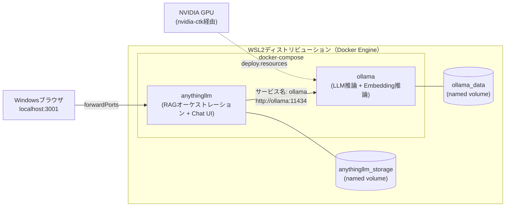

# 01 アーキテクチャとCompose構築

## 所要時間

約30分

## 学習目標

- AnythingLLM（RAGオーケストレーション + Chat UI）とOllama（ローカルLLM推論）の役割分担を説明できる
- docker-composeで両サービスを連携させて起動できる
- WSL2でのGPU passthroughの要否と設定方法を理解する

---

## 全体アーキテクチャ

Ollamaは「LLM推論エンジン」、AnythingLLMは「RAGオーケストレーション + Chat UI」という役割分担です。AnythingLLM自体は推論を行わず、Ollamaのapiにhttpでリクエストを投げるだけなので、06章で学んだComposeのサービス名解決がそのまま使えます。



- WSL/Dockerの基礎（[02章](../02-environment-setup/README.md)）・Compose構文とサービス名解決（[06章](../06-compose-multi-service/README.md)）・named volumeでの永続化（[03章](../03-docker-core-operations/README.md)）は、これまでの章の知識がそのまま使えます。
- モデルファイル（数GB〜十数GB）は`ollama_data`に、AnythingLLM側の設定・ベクトルDB・取り込んだドキュメントは`anythingllm_storage`に永続化されます。`docker compose down`だけならどちらも残ります。

## docker-compose.yml（GPUなし版）

まずはGPUなしで動作確認します。

```bash
mkdir -p ~/projects/local-rag && cd ~/projects/local-rag
```

`docker-compose.yml`:

```yaml
services:
  ollama:
    image: ollama/ollama:latest
    volumes:
      - ollama_data:/root/.ollama

  anythingllm:
    image: mintplexlabs/anythingllm:latest
    environment:
      - LLM_PROVIDER=ollama
      - OLLAMA_BASE_PATH=http://ollama:11434
      - EMBEDDING_ENGINE=ollama
      - EMBEDDING_BASE_PATH=http://ollama:11434
      - EMBEDDING_MODEL_PREF=qwen3-embedding:0.6b
    ports:
      - "3001:3001"
    volumes:
      - anythingllm_storage:/app/server/storage
    depends_on:
      - ollama

volumes:
  ollama_data:
  anythingllm_storage:
```

`OLLAMA_BASE_PATH`にはコンテナ名ではなくComposeの**サービス名**`ollama`を指定します。06章で学んだ通り、Composeが作るユーザー定義bridgeネットワーク上ではサービス名がそのままホスト名として名前解決されるためです。

## 起動と疎通確認

```bash
docker compose up -d
docker compose ps
```

Ollama単体のAPI疎通確認:

```bash
docker compose exec ollama ollama list
```

```
NAME    ID    SIZE    MODIFIED
```

（まだモデルをpullしていないので空です。モデルの選定・取得は[02-selecting-japanese-models.md](./02-selecting-japanese-models.md)で扱います。）

Windows側ブラウザで `http://localhost:3001` を開き、AnythingLLMの初期セットアップ画面が表示されることを確認します。

## GPU passthrough（NVIDIA GPUがある場合）

CPU推論でも動作しますが、7B〜14Bクラスのモデルは応答速度が実用的でないことが多く、GPUがあれば活用すべきです。

WSL2側で、Dockerが使うNVIDIAコンテナランタイムを登録します。

```bash
sudo nvidia-ctk runtime configure --runtime=docker
sudo systemctl restart docker
```

`docker-compose.yml`の`ollama`サービスにGPU予約を追加します。

```yaml
services:
  ollama:
    image: ollama/ollama:latest
    volumes:
      - ollama_data:/root/.ollama
    deploy:
      resources:
        reservations:
          devices:
            - driver: nvidia
              count: all
              capabilities: [gpu]
```

⚠️ WSL2上のDocker Desktop/Docker EngineでのNVIDIA GPU対応は`--gpus all`相当（`count: all`）のみサポートされており、GPUを個別のindexやUUIDで指定することはできません。複数GPU環境でも「全部渡すか、渡さないか」の二択になります。

反映して確認します。

```bash
docker compose up -d
docker compose exec ollama nvidia-smi
```

`nvidia-smi`の出力でGPUが認識されていれば成功です。認識されない場合は、Windows側のNVIDIAドライバがWSL2対応バージョンであること、WSL側に`nvidia-smi`関連パッケージを別途インストールしていないこと（Windows側ドライバのWSLサポート機能を使うため不要）を確認してください。

## 演習

1. GPUなし版の`docker-compose.yml`でOllama + AnythingLLMを起動し、`http://localhost:3001`のセットアップ画面を確認する
2. （NVIDIA GPUがある場合）GPU予約を追加し、`nvidia-smi`でコンテナ内からGPUが見えることを確認する

## 章末チェックリスト

- [ ] AnythingLLMとOllamaの役割分担（オーケストレーション vs 推論）を説明できる
- [ ] `OLLAMA_BASE_PATH`にサービス名を指定する理由を説明できる
- [ ] WSL2でのGPU passthroughが`--gpus all`相当に限定される制約を説明できる

## 次へ

- [02-selecting-japanese-models.md](./02-selecting-japanese-models.md)
