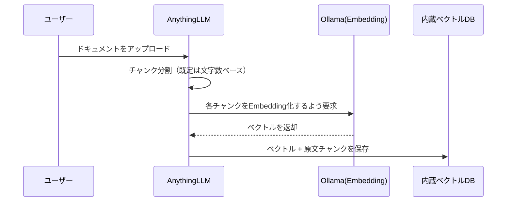

# 03 RAGワークスペース構築と動作確認

## 所要時間

約30分

## 学習目標

- AnythingLLMでワークスペースを作成し、日本語ドキュメントを取り込める
- RAGが実際に参照ドキュメントに基づいて回答しているかを検証できる
- チャンクサイズなど、日本語RAGでつまずきやすい設定を理解する

---

## ワークスペースの作成

AnythingLLMでは「ワークスペース」単位でドキュメントと会話履歴を管理します。

1. `http://localhost:3001` を開き、「+ New Workspace」から任意の名前（例: `local-rag-test`）で作成する
2. ワークスペース設定で、[02-selecting-japanese-models.md](./02-selecting-japanese-models.md)で設定したモデルが選択されていることを確認する

## ドキュメントの取り込み

適当な日本語のテキスト/Markdown/PDFファイルを1つ用意し、ワークスペース内の「Upload」からアップロードします。

```bash
# WSL側に置いておく例（05章で学んだ通り、WSL側ファイルシステムに置く）
mkdir -p ~/projects/local-rag/sample-docs
echo "WSL2はWindows上でLinuxカーネルを動かす仕組みで、Docker Engineは..." > ~/projects/local-rag/sample-docs/sample.txt
```

アップロード後、AnythingLLMは自動的に以下を実行します。



取り込みが終わったら、ワークスペースの「Documents」タブでドキュメントが「Embedded」状態になっていることを確認します。

## 動作確認：RAGが機能しているかの検証

RAGが正しく機能しているかは、**アップロードしたドキュメントにしか書かれていない内容**を質問することで確認します。モデル自体の一般知識で答えられる質問だと、RAGが効いているのか単にLLMが知っているだけなのか区別できません。

```
質問例: 「sample.txtに書かれている、WSL2とDocker Engineの関係を説明してください」
```

回答画面で「Show citations」的な表示（参照元チャンクの引用）が出ていれば、実際にアップロードしたドキュメントを検索して回答していることが確認できます。

## 日本語RAGでつまずきやすい設定

- **チャンクサイズ**: AnythingLLMの既定のチャンク分割は文字数ベースの単純な分割で、日本語の文区切り（句点など）を特別扱いしません。長い技術文書では、文の途中でチャンクが切れて意味が分断されることがあります。回答精度が低い場合は、ワークスペース設定の`Text Chunk Size`を小さくしすぎない（極端に小さいと文脈が失われる）・大きくしすぎない（関係ない内容が混ざる）を試行錯誤する必要があります
- **Embeddingモデルの一致**: 一度ドキュメントを取り込んだ後にEmbedding Preferenceのモデルを変更すると、既存のベクトルと新しい質問のベクトルが別モデルの出力になり、検索精度が大きく落ちます。モデルを変更した場合はドキュメントを再取り込み（re-embed）してください

## 演習

1. 日本語ドキュメントを1つ取り込み、Embedded状態になることを確認する
2. ドキュメントにしか書かれていない内容を質問し、引用（citations）付きで正しく回答できることを確認する
3. Embedding Preferenceのモデルを変更した場合に、ドキュメントの再取り込みが必要になることを確認する

## 章末チェックリスト

- [ ] AnythingLLMでワークスペースを作成し、ドキュメントを取り込めた（[01章](../01-wsl-and-docker-fundamentals/README.md)〜[02章](../02-environment-setup/README.md)のWSL/Docker基礎の上に構築できている）
- [ ] RAGが実際に参照ドキュメントに基づいて回答しているかを、引用表示で検証できた
- [ ] Embeddingモデルを変更した際に再取り込みが必要な理由を説明できる

## この教材のあとに

- 今後の拡張予定は [../../ROADMAP.md](../../ROADMAP.md) を参照してください
- 💡 ブラウザで https://duwenji.github.io/spa-quiz-app/ を開くと、関連トピックをクイズ形式で復習できます
