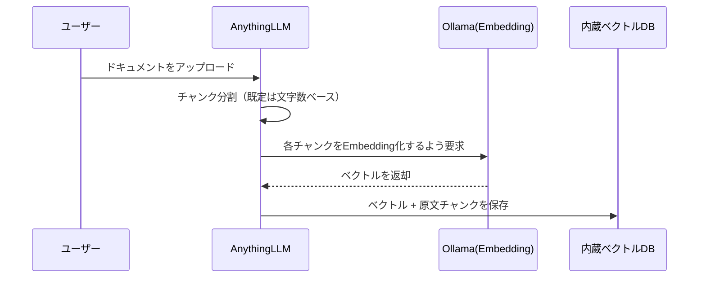

# 03 RAGワークスペース構築と動作確認

## 所要時間

約30分

## 学習目標

- AnythingLLMでワークスペースを作成し、日本語ドキュメントを取り込める
- RAGが実際に参照ドキュメントに基づいて回答しているかを検証できる
- チャンクサイズなど、日本語RAGでつまずきやすい設定を理解する

---

## ワークスペースの作成

AnythingLLMでは「ワークスペース」単位でドキュメントと会話履歴を管理します。

1. `http://localhost:3001` を開き、「+ New Workspace」から任意の名前（例: `local-rag-test`）で作成する
2. ワークスペース設定で、[02-selecting-japanese-models.md](./02-selecting-japanese-models.md)で設定したモデルが選択されていることを確認する

## ドキュメントの取り込み

適当な日本語のテキスト/Markdown/PDFファイルを1つ用意し、ワークスペース内の「Upload」からアップロードします。

```bash
# WSL側に置いておく例（05章で学んだ通り、WSL側ファイルシステムに置く）
mkdir -p ~/projects/local-rag/sample-docs
echo "WSL2はWindows上でLinuxカーネルを動かす仕組みで、Docker Engineは..." > ~/projects/local-rag/sample-docs/sample.txt
```

アップロード後、AnythingLLMは自動的に以下を実行します。



取り込みが終わったら、ワークスペースの「Documents」タブでドキュメントが「Embedded」状態になっていることを確認します。

## 動作確認：RAGが機能しているかの検証

RAGが正しく機能しているかは、**アップロードしたドキュメントにしか書かれていない内容**を質問することで確認します。モデル自体の一般知識で答えられる質問だと、RAGが効いているのか単にLLMが知っているだけなのか区別できません。

```
質問例: 「sample.txtに書かれている、WSL2とDocker Engineの関係を説明してください」
```

回答画面で「Show citations」的な表示（参照元チャンクの引用）が出ていれば、実際にアップロードしたドキュメントを検索して回答していることが確認できます。

## 日本語RAGでつまずきやすい設定

- **チャンクサイズ**: AnythingLLMの既定のチャンク分割は文字数ベースの単純な分割で、日本語の文区切り（句点など）を特別扱いしません。長い技術文書では、文の途中でチャンクが切れて意味が分断されることがあります。回答精度が低い場合は、ワークスペース設定の`Text Chunk Size`を小さくしすぎない（極端に小さいと文脈が失われる）・大きくしすぎない（関係ない内容が混ざる）を試行錯誤する必要があります
- **Embeddingモデルの一致**: 一度ドキュメントを取り込んだ後にEmbedding Preferenceのモデルを変更すると、既存のベクトルと新しい質問のベクトルが別モデルの出力になり、検索精度が大きく落ちます。モデルを変更した場合はドキュメントを再取り込み（re-embed）してください

## トラブルシューティング：チャットで「model is required」

AnythingLLMでチャットを送信すると`model is required`というエラーが返ることがあります。これはAnythingLLMがOllamaにチャットリクエストを送る際に**モデル名が空のまま送信されている**ときに出るエラーで、Ollama側APIが必須パラメータ`model`を受け取れずに返したメッセージがそのままUIに表示されたものです。多くの場合、[02-selecting-japanese-models.md](./02-selecting-japanese-models.md)の「pull後にUI側でモデル名を選び直す」手順が未実施か、途中で外れています。

AnythingLLMを介さず、原因を切り分けながら確認します。

**1. コンテナが起動しているか**

```bash
docker compose ps -a
```

`ollama`サービスの`STATUS`が`Up`になっているか確認します。

**2. モデルがpull済みか**

```bash
docker compose exec ollama ollama list
```

使いたいモデル（例: `qwen3:8b`）が一覧に出ていなければpull未実施です。

**3. Ollama単体で推論できるか（AnythingLLMを経由しない切り分け）**

```bash
docker compose exec ollama ollama run qwen3:8b "こんにちは、調子はどうですか？"
```

ここで応答が返れば、Ollama自体・モデルロードは正常です。失敗する場合は問題がOllama/モデルファイル側にあります。

**4. コンテナ間のHTTP疎通確認**

```bash
docker compose exec anythingllm curl -s http://ollama:11434/api/tags
```

このコマンドがJSONで返れば、`anythingllm` から `ollama` へのHTTP通信と、Compose内DNSによるサービス名解決が正常に動いています。実際の確認結果では、以下のように `qwen3:8b` などのモデル一覧が返りました。

```json
{
  "models": [
    {
      "name": "qwen3:8b",
      "model": "qwen3:8b",
      "details": {
        "family": "qwen3",
        "parameter_size": "8.2B",
        "quantization_level": "Q4_K_M"
      }
    },
    {
      "name": "nomic-embed-text-v2-moe:latest",
      "model": "nomic-embed-text-v2-moe:latest"
    },
    {
      "name": "embeddinggemma:latest",
      "model": "embeddinggemma:latest"
    }
  ]
}
```

このように、`anythingllm` から `ollama:11434` にアクセスできていることが確認できれば、ネットワークの問題はかなり小さくなります。モデル一覧がJSONで返らない場合は、サービス名解決やネットワークの問題（[01-architecture-and-compose-setup.md](./01-architecture-and-compose-setup.md)で説明したCompose内DNS）を疑います。

**5. `model`指定付きで`/api/chat`を確認する（`curl`が入っていない場合は`anythingllm`側から確認）**

Ollamaコンテナイメージには `curl` が入っていないことがあり、以下のような失敗が起きます。

```bash
docker compose exec ollama curl -s http://localhost:11434/api/chat -d '{
  "model": "qwen3:8b",
  "messages": [{"role":"user","content":"test"}],
  "stream": false
}'
# -> OCI runtime exec failed: exec: "curl": executable file not found in $PATH
```

その場合は、`anythingllm` コンテナから Ollama へ直接アクセスして確認します。

```bash
docker compose exec anythingllm curl -s -X POST http://ollama:11434/api/chat \
  -H 'Content-Type: application/json' \
  -d '{
    "model": "qwen3:8b",
    "messages": [{"role":"user","content":"test"}],
    "stream": false
  }'
```

このコマンドが正常に返るなら、Ollama自体は「modelさえ渡せば」正常に動作しているということです。実際の確認結果では、次のようなレスポンスが返りました。

```json
{"model":"qwen3:8b","created_at":"2026-08-30T05:44:39.541874577Z","message":{"role":"assistant","content":"Hello! It looks like you're testing me. How can I assist you today? 😊"},"done":true}
```

`"model":"qwen3:8b"` と `"role":"assistant"` が含まれており、モデルが推論して文章を返しているため、Ollama側の起動・ロード・推論は正常です。したがって、原因は**AnythingLLM側のモデル選択設定**（設定 → LLM Preference、およびワークスペース個別のChat Settingsが両方とも空になっていないか）に絞り込めます。

**6. ログで実際の送信内容を確認**

```bash
docker compose logs anythingllm --tail=50
docker compose logs ollama --tail=50
```

`anythingllm`のログに、実際にOllamaへ送られたリクエストやエラー詳細が出ていることが多いです。

## 演習

1. 日本語ドキュメントを1つ取り込み、Embedded状態になることを確認する
2. ドキュメントにしか書かれていない内容を質問し、引用（citations）付きで正しく回答できることを確認する
3. Embedding Preferenceのモデルを変更した場合に、ドキュメントの再取り込みが必要になることを確認する
4. あえてAnythingLLMのLLM Preferenceを未選択にした状態でチャットし、「model is required」エラーを再現した上で、上記の切り分け手順でOllama自体は正常であることを確認する

## 章末チェックリスト

- [ ] AnythingLLMでワークスペースを作成し、ドキュメントを取り込めた（[01章](../01-wsl-and-docker-fundamentals/README.md)〜[02章](../02-environment-setup/README.md)のWSL/Docker基礎の上に構築できている）
- [ ] RAGが実際に参照ドキュメントに基づいて回答しているかを、引用表示で検証できた
- [ ] Embeddingモデルを変更した際に再取り込みが必要な理由を説明できる
- [ ] 「model is required」エラーが出た際に、AnythingLLMを介さずOllama単体の正常性を切り分けて確認できる

## 次へ

- [04-container-runtime-internals.md](./04-container-runtime-internals.md)（発展・任意）
