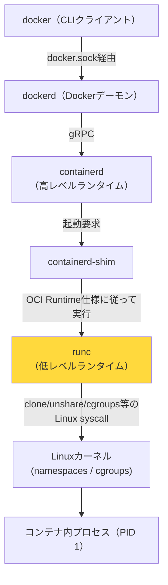
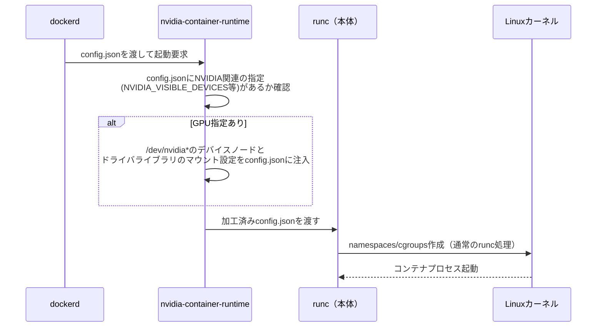

# 04 コンテナランタイムの仕組み（発展）

## 所要時間

約20分

## 学習目標

- `dockerd`・`containerd`・`runc`の三層構造とそれぞれの役割を説明できる
- `runc`が実際に行うLinux syscallレベルの処理（namespaces/cgroups/pivot_root）を説明できる
- `nvidia-container-runtime`が`runc`を置き換えるのではなく「ラップするシム」である理由を説明できる

この節は任意の発展内容です。[01-architecture-and-compose-setup.md](./01-architecture-and-compose-setup.md)のGPU passthroughで登場した`nvidia-ctk runtime configure`が何をしているのかを、より深いレイヤーまで掘り下げます。

---

## コンテナランタイムとは

**コンテナランタイム**とは、「Linuxカーネルの機能（namespaces・cgroups等）を実際に呼び出して、隔離されたプロセス＝コンテナを生成・起動するソフトウェア」のことです。[01章](../01-wsl-and-docker-fundamentals/README.md)で学んだ「Dockerはnamespaces/cgroupsを使う」という説明の、**具体的に誰がその呼び出しをしているか**を担うレイヤーです。

`docker`コマンドや`dockerd`は、実はコンテナを直接作っていません。[01章03-docker-concepts.md](../01-wsl-and-docker-fundamentals/03-docker-concepts.md)で学んだ「`docker`(CLI) → `dockerd`」の関係の先に、さらに階層が続いています。

## 高レベルランタイムと低レベルランタイムの役割分担

| 層                 | 担当           | やっていること                                                                                                                                                                              |
| ------------------ | -------------- | ------------------------------------------------------------------------------------------------------------------------------------------------------------------------------------------- |
| 高レベルランタイム | `containerd` | イメージのpull・保存、コンテナのライフサイクル管理（作成・停止・削除）、ネットワーク/ボリュームの割り当て指示。**実際にnamespacesを作る低レベルの処理はしない**                       |
| 低レベルランタイム | `runc`       | `containerd`から受け取った設定（`config.json`）に従い、実際にLinuxカーネルのsyscallを叩いてコンテナを作る。**OCI（Open Container Initiative）が定めたRuntime Specに準拠した実装** |

`runc`が実際にやっていることを分解すると、以下の手順になります。

1. `config.json`（rootfsの場所・環境変数・実行コマンド・必要なnamespaces種別などを記述したOCI仕様のファイル）を読み込む
2. `clone()`/`unshare()`というLinux syscallに、`CLONE_NEWPID`・`CLONE_NEWNET`・`CLONE_NEWNS`などのフラグを渡し、PID/ネットワーク/マウントなどのnamespacesを新規作成する
3. cgroupsを設定し、CPU・メモリの上限を適用する
4. `pivot_root`（ルートファイルシステムの切り替え）で、コンテナから見えるファイルシステムをイメージのrootfsだけに限定する
5. capabilities（root権限の一部機能だけに絞る仕組み）やseccomp（使えるsyscallを制限する仕組み）を適用する
6. 最後に`execve()`でコンテナ内のプロセス（PID 1）を実行する

`runc`自身はコンテナを起動したらすぐにプロセスとしては終了します。`runc`が死んでもコンテナ本体が道連れで落ちないよう、`containerd-shim`という常駐プロセスが親として生き残り、コンテナプロセスを見守り続ける構造になっています。

## NVIDIA Container Toolkitはこの階層のどこに入るか

[01-architecture-and-compose-setup.md](./01-architecture-and-compose-setup.md)の`nvidia-ctk runtime configure --runtime=docker`で`daemon.json`に登録される`nvidia-container-runtime`は、`runc`を**置き換える**のではなく、`runc`を**ラップするシム**です。

つまり`docker-compose.yml`の`deploy.resources.reservations.devices`で`capabilities: [gpu]`を指定すると、`dockerd`は通常の`runc`ではなく`nvidia-container-runtime`を呼び出し、そこでGPUデバイスとドライバのマウント設定が**普通のコンテナ設定に注入されてから**、最終的に`runc`が通常通りnamespaces/cgroupsを作る、という流れです。GPUを使わない大多数のコンテナに対しては、`runc`がそのまま直接呼ばれます。

## 章末チェックリスト

- [ ] `dockerd`・`containerd`・`runc`の三層構造とそれぞれの役割を説明できる
- [ ] `runc`が実際に行うLinux syscallレベルの処理（namespaces/cgroups/pivot_root）を説明できる
- [ ] `nvidia-container-runtime`が`runc`を置き換えるのではなく「ラップするシム」である理由を説明できる

## この教材のあとに

- 今後の拡張予定は [../../ROADMAP.md](../../ROADMAP.md) を参照してください
- 💡 ブラウザで https://duwenji.github.io/spa-quiz-app/ を開くと、関連トピックをクイズ形式で復習できます
