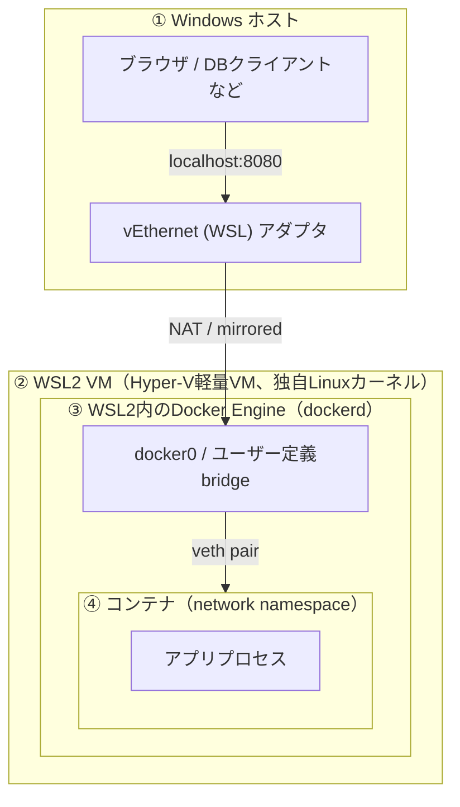
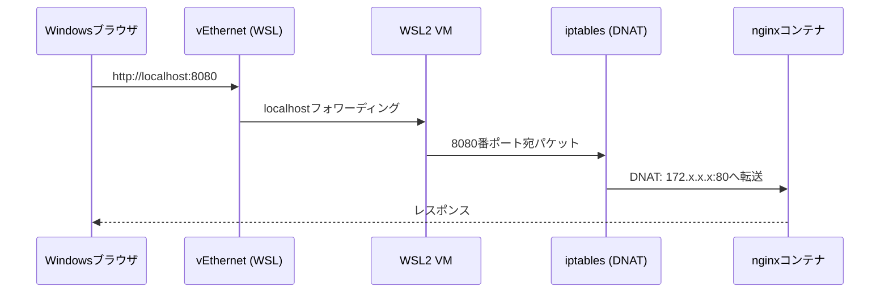

# Windows WSL Docker Tutorial Implementation Plan

> **For agentic workers:** REQUIRED SUB-SKILL: Use superpowers:subagent-driven-development (recommended) or superpowers:executing-plans to implement this plan task-by-task. Steps use checkbox (`- [ ]`) syntax for tracking.

**Goal:** Windows + WSL2 + Docker Engine（Docker Desktop不使用）で開発する日本語教材を、姉妹教材と同じ構成規約で `windows-wsl-docker-tutorial` リポジトリに新規作成する。

**Architecture:** 既存の `kubernetes-tutorial` / `css-tutorial` と同じ「独立git repo + `docs/NN-章名/README.md`+レッスンファイル + ルート補助ファイル + ebook-build連携」構成をそのまま踏襲し、内容だけをWSL/Docker向けに書き下ろす。このプランは通常のTDDソフトウェア開発ではなくMarkdown教材の執筆なので、各タスクの「テスト」は「見出し構成・内部リンク・コマンド例の整合性を目視確認する」ことに読み替える。

**Tech Stack:** Markdown, PowerShell 7 (`pwsh`, ebook-build用), Pandoc/Mermaid CLI（ebook-build依存、既存 `shared-copilot-skills/ebook-build` を再利用）

**Spec:** `docs/superpowers/specs/2026-08-29-windows-wsl-docker-tutorial-design.md`

## Global Constraints

- 対象読者: WSL/Docker両方未経験だが実務利用前提。前提知識を勝手に増やさない。
- 主軸環境: WSL2 + Docker Engine直接インストール（Docker Desktopは02章の比較コラムのみ）。
- 文章スタイル: 要点を短く書いた後に手順・コマンド例・確認方法を続ける。コマンド/ファイル名/キー名はバッククォート。`✅`/`⚠️`/`💡`を適宜使う。
- コマンド例はそのままコピーして試せる状態にする。
- 章ディレクトリは `docs/NN-slug/`、レッスンファイルは `NN-slug.md`（章内連番2桁）、各章に `README.md`（章概要・学習目標・演習案・成功判定・次章リンク）を置く。
- 各レッスンファイルの末尾に「章末チェックリスト」または「次へ」リンクを置く（kubernetes-tutorialの慣例に合わせる）。
- ebook-buildの章検出パターン: `chapterDirPattern: "^\\d{2}-"`, `chapterFilePattern: "^\\d{2}-.*\\.md$"`。
- クイズ誘導コールアウトは `README.md` と `docs/00-COVER.md` の両方に標準文言をそのまま設置する:
  `> 💡 ブラウザで https://duwenji.github.io/spa-quiz-app/ を開くと、関連トピックをクイズ形式で復習できます。`

---

## Task 1: ルートスキャフォールディング + `.github` + ebook-build設定

**Files:**
- Create: `.gitattributes`
- Create: `LICENSE`
- Create: `CONTRIBUTING.md`
- Create: `CHANGELOG.md`
- Create: `ROADMAP.md`
- Create: `PUBLISHING.md`
- Create: `VALIDATION_CHECKLIST.md`
- Create: `.github/copilot-instructions.md`
- Create: `.github/pull_request_template.md`
- Create: `.github/ISSUE_TEMPLATE/bug_report.yml`
- Create: `.github/ISSUE_TEMPLATE/feature_request.yml`
- Create: `.github/ISSUE_TEMPLATE/config.yml`
- Create: `.github/skills-config/ebook-build/windows-wsl-docker-tutorial.build.json`
- Create: `.github/skills-config/ebook-build/windows-wsl-docker-tutorial.metadata.yaml`
- Create: `.github/skills-config/ebook-build/windows-wsl-docker-tutorial.kdp.yaml`
- Create: `.github/skills-config/ebook-build/invoke-build.ps1`

**Interfaces:**
- Produces: ebook-build config が参照する `projectName: "windows-wsl-docker-tutorial"`、`sourceRoot: "./docs"`、`coverFile: "00-COVER.md"` — 以降のタスクで作る `docs/00-COVER.md` と `docs/NN-*` 構成がこれに一致する必要がある。

- [ ] **Step 1: `.gitattributes` を作成**

`kubernetes-tutorial/.gitattributes` と同一内容:

```
* text=auto
*.ps1 text eol=crlf
*.yml text eol=lf
*.yaml text eol=lf
*.md text eol=lf
*.json text eol=lf
```

- [ ] **Step 2: `LICENSE` を作成**

`kubernetes-tutorial/LICENSE` と同じMITライセンス文面。`Copyright (c) 2026 Duwenji` の行はそのまま流用する。

- [ ] **Step 3: `CONTRIBUTING.md` を作成**

`kubernetes-tutorial/CONTRIBUTING.md` を土台に、「Kubernetesマニフェスト」を「Dockerコマンド/Compose定義」に、"kind/minikube"のような固有語を本教材の内容に置き換えて書く。基本方針・推奨フロー・レビュー観点の3セクション構成を維持する。

- [ ] **Step 4: `CHANGELOG.md` を作成**

```markdown
# CHANGELOG

## v1.0.0 - 2026-08-29

### Added
- Windows + WSL2 + Docker Engine 向け教材の初版を作成
- `docs/` 配下に01〜09章構成の教材本文を追加
- 姉妹教材と共通の補助ファイル（`MASTER-INDEX.md`, `QUICK-REFERENCE.md`, `COMPLETION-REPORT.md`, `PUBLISHING.md`, `VALIDATION_CHECKLIST.md`）を追加
- ebook-build設定を `.github/skills-config/ebook-build/` に追加
```

- [ ] **Step 5: `ROADMAP.md` を作成**

```markdown
# ROADMAP

## Near term
- 各章のハンズオン手順にスクリーンショットを追加
- ネットワーク章（04）にネットワーク構成図（Mermaid）を追加

## Mid term
- 企業プロキシ環境固有のトラブルシュート事例を追加
- Docker Composeでのマルチコンテナ実践演習を拡充

## Future
- 英語翻訳
- Kubernetes連携（kubernetes-tutorialへの橋渡し章）
```

- [ ] **Step 6: `PUBLISHING.md` を作成**

`kubernetes-tutorial/PUBLISHING.md` を土台にプロジェクト名のみ `windows-wsl-docker-tutorial` に置換する。

- [ ] **Step 7: `VALIDATION_CHECKLIST.md` を作成**

`kubernetes-tutorial/VALIDATION_CHECKLIST.md` を土台にプロジェクト名を置換し、最終行を「WSL/Dockerコマンド例が現行バージョンに合っている」に書き換える。

- [ ] **Step 8: `.github/copilot-instructions.md` を作成**

```markdown
# GitHub Copilot Instructions

このリポジトリは、`Windows + WSL2 + Docker Engine` を初めて学ぶ人向けの日本語教材です。WSLの基礎からDocker Engineの直接導入、ネットワークの仕組み、開発ワークフロー、Compose運用、トラブルシューティング、セキュリティまでを段階的に扱います。

## 回答方針
- 説明は **日本語** で行う
- 対象読者は WSL/Docker 未経験〜初学者だが、実務での利用を前提とした深さまで踏み込む
- 抽象的な用語説明で終わらせず、**手を動かして確認できる手順**を優先する
- ネットワークやファイル共有など「Windows・WSL2・Docker」の層構造が絡む話題は、どの層で何が起きているかを必ず明示する
- 本番運用の高度な最適化よりも、**基礎を正しく理解すること**を優先する

## 文章スタイル
- まず要点を短く書く
- その後に手順、コマンド例、確認方法を続ける
- コマンド、ファイル名、設定キー名はバッククォートで示す
- 必要に応じて `✅`、`⚠️`、`💡` を使って読みやすくする
- コマンド例は、コピーしてそのまま試せる状態で提示する

## 技術方針
- 前提環境は `Windows 11 + WSL2`。ディストロは既定でUbuntuを使う
- Dockerは **WSL内へのDocker Engine直接インストール**（`apt install docker-ce`系）を主軸とする。Docker Desktopは02章の比較コラムでのみ触れる
- 電子書籍ビルドは `shared-copilot-skills/ebook-build` を利用する（`invoke-build.ps1 -BuildStep step1` ～ `step3`, `step2b`）
- 企業プロキシ・証明書・Secretの扱いについては、学習用途であっても必ず注意点を明記する

## 教材として優先する内容
1. WSL2とDockerの位置づけ・アーキテクチャの正確な理解
2. WSL内でのDocker Engine直接導入によるローカル開発環境構築
3. Windows⇔WSL2 VM⇔Docker Engine⇔コンテナのネットワーク層構造の理解
4. ファイル共有・パフォーマンス・Dev Containersを使った実務向け開発ワークフロー
5. 運用・トラブルシューティング・セキュリティの基本
```

- [ ] **Step 9: `.github/pull_request_template.md` を作成**

`kubernetes-tutorial/.github/pull_request_template.md` を土台に「Kubernetes」の記述を「WSL/Docker」に、`npm run ebook:build` を `pwsh .github/skills-config/ebook-build/invoke-build.ps1 -BuildStep step1` に置換する。

- [ ] **Step 10: `.github/ISSUE_TEMPLATE/bug_report.yml` を作成**

`kubernetes-tutorial` 版を土台に、placeholder例を `03-image-basics.md` のようなこのリポジトリのファイル名に、環境欄の説明を「OS、WSLバージョン、Dockerバージョンなど」に置換する。

- [ ] **Step 11: `.github/ISSUE_TEMPLATE/feature_request.yml` を作成**

`kubernetes-tutorial` 版を土台に、dropdownの選択肢をこのリポジトリの01〜09章タイトルに置換する（下記Chapter一覧を使用）。

```
01. WSL and Docker Fundamentals
02. Environment Setup
03. Docker Core Operations
04. Networking Deep Dive
05. Dev Workflow and File Sharing
06. Compose Multi Service
07. Operations and Troubleshooting
08. Security and Enterprise Network
09. Capstone Project
その他（QUICK-REFERENCE / MASTER-INDEX など）
```

- [ ] **Step 12: `.github/ISSUE_TEMPLATE/config.yml` を作成**

`kubernetes-tutorial` 版を土台に、URLを `https://github.com/duwenji/windows-wsl-docker-tutorial/discussions` に置換する。

- [ ] **Step 13: `.github/skills-config/ebook-build/windows-wsl-docker-tutorial.build.json` を作成**

```json
{
  "sourceRoot": "./docs",
  "outputDir": "./ebook-output",
  "projectName": "windows-wsl-docker-tutorial",
  "formats": [
    "epub",
    "pdf",
    "kdp-markdown"
  ],
  "metadataFile": "./.github/skills-config/ebook-build/windows-wsl-docker-tutorial.metadata.yaml",
  "kdpMetadataFile": "./.github/skills-config/ebook-build/windows-wsl-docker-tutorial.kdp.yaml",
  "chapterDirPattern": "^\\d{2}-",
  "chapterFilePattern": "^\\d{2}-.*\\.md$",
  "coverFile": "00-COVER.md",
  "mermaidMode": "required",
  "mermaidFormat": "svg",
  "failOnMermaidError": true,
  "preserveTemp": false
}
```

- [ ] **Step 14: `.github/skills-config/ebook-build/windows-wsl-docker-tutorial.metadata.yaml` を作成**

```yaml
title: "Windows WSL Docker教材（初学者向け）"
subtitle: "WSL2 + Docker Engineで学ぶ実践ガイド"
creator: "杜 文吉"
date: "2026-08-29"
language: ja-JP
publisher: "Self Published"
rights: "Creative Commons Attribution 4.0 International License"
identifier: "windows-wsl-docker-tutorial-v1"
description: |
  Windows 11 + WSL2 + Docker Engine 未経験者が、環境構築からネットワークの仕組み、
  開発ワークフロー、運用、セキュリティまでを段階的に学べる日本語教材です。
  Docker Desktopに頼らずWSL内でDocker Engineを直接動かし、Windows・WSL2・Docker間の
  層構造を正確に理解することを重視しています。
keywords:
  - WSL
  - WSL2
  - Docker
  - Docker Engine
  - DevOps
  - Windows
  - Networking
cover: "00-COVER.md"
toc: true
toc-depth: 2
chapters:
  auto-discover: true
  dir-pattern: "^\\d{2}-"
  file-pattern: "^\\d{2}-.*\\.md$"
include-readme: false
version: "1.0"
revision-date: "2026-08-29"
license: "CC-BY-4.0"
license-url: "https://creativecommons.org/licenses/by/4.0/"
```

- [ ] **Step 15: `.github/skills-config/ebook-build/windows-wsl-docker-tutorial.kdp.yaml` を作成**

`kubernetes-tutorial` 版を土台にタイトル・説明文をこのリポジトリの内容に置換する（`trimSize: "6in x 9in"` 等の値はそのまま流用）。

- [ ] **Step 16: `.github/skills-config/ebook-build/invoke-build.ps1` を作成**

`kubernetes-tutorial` 版と同一ロジックで、`ConfigFile` 既定値のみ `.github/skills-config/ebook-build/windows-wsl-docker-tutorial.build.json` に置換する。

- [ ] **Step 17: 目視確認**

- `.github/skills-config/ebook-build/*.json` がJSONとしてparse可能か `pwsh -Command "Get-Content <path> | ConvertFrom-Json"` で確認する（pwshが無い場合は `python -m json.tool <path>` でも可）。
- 全ファイルが作成されていることを `git status` で確認する。

- [ ] **Step 18: Commit**

```bash
git add .gitattributes LICENSE CONTRIBUTING.md CHANGELOG.md ROADMAP.md PUBLISHING.md VALIDATION_CHECKLIST.md .github
git commit -m "chore: add root scaffolding, github templates, and ebook-build config"
```

---

## Task 2: `docs/00-COVER.md`, `docs/index.md`, `docs/_config.yml`

**Files:**
- Create: `docs/00-COVER.md`
- Create: `docs/index.md`
- Create: `docs/_config.yml`

**Interfaces:**
- Consumes: Task 1で決めた `coverFile: "00-COVER.md"`。
- Produces: `README.md`（Task 11）から参照される章一覧の見出し文言（01〜09の章タイトル）はここで確定させ、以降のタスクは同じ文言を使う。

- [ ] **Step 1: `docs/00-COVER.md` を作成**

```markdown
# Windows WSL Docker Tutorial

## WSL2 + Docker Engineで学ぶ実践ガイド

Windows 11 上で WSL2 と Docker Engine を組み合わせて開発するための日本語教材です。Docker Desktopに頼らず、WSL内にDocker Engineを直接導入し、Windows・WSL2・Docker間のネットワークの仕組みまで正確に理解できるように構成しています。

> 💡 ブラウザで https://duwenji.github.io/spa-quiz-app/ を開くと、関連トピックをクイズ形式で復習できます。

---

## 本書で学べること

- WSL2とDockerの位置づけ、全体アーキテクチャ
- WSL内でのDocker Engine直接導入によるローカル開発環境構築
- Windows ⇔ WSL2 VM ⇔ Docker Engine ⇔ コンテナのネットワーク層構造
- ファイル共有・パフォーマンスを踏まえた実務向け開発ワークフロー
- 運用・トラブルシューティング・セキュリティの基本

## 対象読者

- WSL、Dockerともに未経験の開発者
- Windows上でDocker前提の開発案件に参加することになったエンジニア
- Docker Desktopのライセンスを避けてWSL単体でDocker環境を構築したい実務担当者
```

- [ ] **Step 2: `docs/index.md` を作成**

```markdown
---
layout: home
title: Windows WSL Docker 教材
---

# Windows WSL Docker 教材

WSL2 + Docker Engine を使ってWindows上で開発するための日本語教材です。

## 学習ガイド

- [01. WSL and Docker Fundamentals](01-wsl-and-docker-fundamentals/README.md)
- [02. Environment Setup](02-environment-setup/README.md)
- [03. Docker Core Operations](03-docker-core-operations/README.md)
- [04. Networking Deep Dive](04-networking-deep-dive/README.md)
- [05. Dev Workflow and File Sharing](05-dev-workflow-and-file-sharing/README.md)
- [06. Compose Multi Service](06-compose-multi-service/README.md)
- [07. Operations and Troubleshooting](07-operations-and-troubleshooting/README.md)
- [08. Security and Enterprise Network](08-security-and-enterprise-network/README.md)
- [09. Capstone Project](09-capstone-project/README.md)

## 補助資料

- [QUICK REFERENCE](../QUICK-REFERENCE.md)
- [MASTER INDEX](../MASTER-INDEX.md)
```

- [ ] **Step 3: `docs/_config.yml` を作成**

```yaml
title: Windows WSL Docker 教材
description: WSL2 + Docker Engineを使ってWindows上で開発するための日本語教材
baseurl: "/windows-wsl-docker-tutorial"
url: "https://duwenji.github.io"
theme: minima
markdown: kramdown
```

- [ ] **Step 4: 目視確認**

`docs/index.md` 内の9つのリンクが、これから作る章ディレクトリ名（Task 3〜11で作成）と完全一致することを確認する。

- [ ] **Step 5: Commit**

```bash
git add docs/00-COVER.md docs/index.md docs/_config.yml
git commit -m "docs: add cover page and GitHub Pages entry files"
```

---

## Task 3: 01章 — WSL and Docker Fundamentals

**Files:**
- Create: `docs/01-wsl-and-docker-fundamentals/README.md`
- Create: `docs/01-wsl-and-docker-fundamentals/01-why-wsl-and-docker.md`
- Create: `docs/01-wsl-and-docker-fundamentals/02-wsl-architecture.md`
- Create: `docs/01-wsl-and-docker-fundamentals/03-docker-concepts.md`

**Interfaces:**
- Produces: 「WSL2 VMはHyper-V上の軽量ユーティリティVMである」「WSL2は独自Linuxカーネルを持つ」という説明を確定させる。04章（ネットワーク深掘り）はこの説明を前提に層構造を組み立てるので、用語（VM、Linuxカーネル、名前空間）をここで統一する。

- [ ] **Step 1: `01-why-wsl-and-docker.md` を作成**

以下の見出し構成で執筆する:
- `## この章で学ぶこと`
- `## Dockerとは何か`（コンテナ＝プロセス隔離であり仮想マシンではないこと、image/containerの違い）
- `## なぜDockerにLinuxカーネルが必要か`（LinuxのcgroupsとnamespacesにDockerが依存している事実。WindowsネイティブにはLinuxコンテナを直接動かすカーネル機構がない）
- `## なぜWSLが必要か`（WSL2がLinuxカーネルをWindows上で提供する仕組みの入り口としての位置づけ）
- `## Docker Desktop / WSL+Docker Engine / Hyper-V VM の3つの選択肢比較`（表形式で、本教材はWSL+Docker Engineを選ぶ理由を明記）
- `## 次へ`リンク（`02-wsl-architecture.md`）

- [ ] **Step 2: `02-wsl-architecture.md` を作成**

以下の見出し構成で執筆する:
- `## 所要時間`
- `## 学習目標`
- `## WSL1とWSL2の違い`（WSL1はシステムコール変換層、WSL2は軽量VM+実Linuxカーネルという決定的な違いを表で示す。Dockerが動くのはWSL2のみである理由を明記）
- `## WSL2の実体: Hyper-Vベースの軽量ユーティリティVM`（`Vmmem`プロセスとして見えること、`wsl --status`, `wsl -l -v`コマンドでの確認）
- `## ディストリビューションとWSL2 VMの関係`（1つのWSL2 VM(lightweight utility VM)の上で各ディストロが動く現行アーキテクチャを説明。ディストロを跨いだファイル・ネットワークの共有範囲に軽く触れ、詳細は04章に繋げる）
- `## 演習`（`wsl --status` と `wsl -l -v` を実行し出力を確認する）
- `## 章末チェックリスト`
- `## 次へ`リンク（`03-docker-concepts.md`）

- [ ] **Step 3: `03-docker-concepts.md` を作成**

以下の見出し構成で執筆する:
- `## 所要時間`
- `## 学習目標`
- `## イメージとコンテナ`（クラス/インスタンスの比喩は使わず、レイヤ構造のtarとして正確に説明する）
- `## レジストリとタグ`（Docker Hubの位置づけ、`image:tag`表記）
- `## Dockerデーモンとクライアント`（`dockerd`と`docker` CLIの関係、`docker.sock`経由の通信）
- `## 03章以降で使うコマンドの全体像`（`docker run`, `docker build`, `docker ps`, `docker volume`, `docker network`を一覧表示するだけに留め、詳細は03章に譲る）
- `## 章末チェックリスト`
- `## 次へ`リンク（`../02-environment-setup/README.md`）

- [ ] **Step 4: `README.md` を作成**

`kubernetes-tutorial/docs/01-kubernetes-fundamentals/README.md` と同じ構成（この章で学ぶこと／学習目標／演習案／成功判定／次章へ）で執筆する。演習案は「Docker Desktop・WSL+Docker Engine・Hyper-V VMの3方式を比較した表を自分の言葉で作る」等、上記レッスンの内容に対応させる。

- [ ] **Step 5: 目視確認**

各ファイル内の相互リンク（`01-why-wsl-and-docker.md`→`02-`→`03-`→`README.md`→次章）が実在するファイル名と一致するか確認する。

- [ ] **Step 6: Commit**

```bash
git add docs/01-wsl-and-docker-fundamentals
git commit -m "docs: write chapter 01 WSL and Docker fundamentals"
```

---

## Task 4: 02章 — Environment Setup

**Files:**
- Create: `docs/02-environment-setup/README.md`
- Create: `docs/02-environment-setup/01-install-wsl.md`
- Create: `docs/02-environment-setup/02-install-docker-engine.md`
- Create: `docs/02-environment-setup/03-vscode-remote-wsl.md`
- Create: `docs/02-environment-setup/04-docker-desktop-comparison.md`

**Interfaces:**
- Consumes: 01章で確定した「WSL2 VM」「Docker Engine直接導入」という用語・方針。
- Produces: `docker`グループへのユーザー追加、`sudo service docker start`（WSLではsystemdが既定で無効な場合があるため`service`コマンドを使う、またはWSL 0.67.6+の`systemd=true`設定に触れる）という起動手順を確定させる。03章以降のコマンド例はこの前提（`docker`コマンドが`sudo`無しで動く状態）で書く。

- [ ] **Step 1: `01-install-wsl.md` を作成**

見出し構成:
- `## 所要時間` / `## 学習目標`
- `## 前提条件`（Windows 11、仮想化有効化のBIOS設定確認）
- `## WSLのインストール`（`wsl --install`一発導入、既定でUbuntuが入ること）
- `## ディストリビューションを指定する場合`（`wsl --install -d Ubuntu-22.04`、`wsl -l -o`で一覧表示）
- `## WSL2がデフォルトであることの確認`（`wsl -l -v`でVERSION列が2であることを確認）
- `## リソース制限の初期設定`（`.wslconfig`の存在場所`%UserProfile%\.wslconfig`と最小限のmemory/processors設定例。詳細チューニングは07章に譲る旨を明記）
- `## 演習` / `## 章末チェックリスト` / `## 次へ`リンク（`02-install-docker-engine.md`）

- [ ] **Step 2: `02-install-docker-engine.md` を作成**

見出し構成:
- `## 所要時間` / `## 学習目標`
- `## なぜDocker Desktopを使わないか`（01章の比較を1行で再掲し、詳細は`04-docker-desktop-comparison.md`に譲る）
- `## Docker Engineのインストール手順`（Ubuntu上での公式リポジトリ追加からのコマンド一式）:

```bash
sudo apt-get update
sudo apt-get install -y ca-certificates curl gnupg
sudo install -m 0755 -d /etc/apt/keyrings
curl -fsSL https://download.docker.com/linux/ubuntu/gpg | sudo gpg --dearmor -o /etc/apt/keyrings/docker.gpg
sudo chmod a+r /etc/apt/keyrings/docker.gpg

echo \
  "deb [arch=$(dpkg --print-architecture) signed-by=/etc/apt/keyrings/docker.gpg] https://download.docker.com/linux/ubuntu \
  $(. /etc/os-release && echo "$VERSION_CODENAME") stable" | \
  sudo tee /etc/apt/sources.list.d/docker.list > /dev/null

sudo apt-get update
sudo apt-get install -y docker-ce docker-ce-cli containerd.io docker-buildx-plugin docker-compose-plugin
```

- `## dockerグループへの追加（sudoなしでdockerを使う）`:

```bash
sudo usermod -aG docker $USER
```

WSLを再起動（`wsl --shutdown`をWindows側PowerShellで実行後、再度ターミナルを開く）してグループ変更を反映させる旨を明記する。

- `## Dockerデーモンの起動`（WSLではsystemdが既定で無効なディストロがあるため、以下の2パターンを併記する）:
  - パターンA: `sudo service docker start`（都度起動、WSL再起動のたびに再実行が必要）
  - パターンB: `/etc/wsl.conf`に`[boot]\nsystemd=true`を設定してsystemdを有効化し、`sudo systemctl enable docker`で自動起動させる（WSL再起動が必要、`wsl --shutdown`後に反映）
- `## 動作確認`:

```bash
docker version
docker run hello-world
```

- `## 演習` / `## 章末チェックリスト` / `## 次へ`リンク（`03-vscode-remote-wsl.md`）

- [ ] **Step 3: `03-vscode-remote-wsl.md` を作成**

見出し構成:
- `## 所要時間` / `## 学習目標`
- `## VS Code + Remote-WSL拡張のインストール`（拡張機能ID `ms-vscode-remote.remote-wsl`、WSL側ターミナルから`code .`で起動する連携方法）
- `## Dev Containers拡張のインストール`（拡張機能ID `ms-vscode-remote.remote-containers`、05章で本格的に使う旨を明記）
- `## Docker拡張（任意）`（`ms-azuretools.vscode-docker`、コンテナ/イメージのGUI確認に使える程度の紹介）
- `## 演習` / `## 章末チェックリスト` / `## 次へ`リンク（`04-docker-desktop-comparison.md`）

- [ ] **Step 4: `04-docker-desktop-comparison.md` を作成**

見出し構成:
- `## 所要時間` / `## 学習目標`
- `## 比較コラム: Docker Desktop vs WSL+Docker Engine直接導入`（表形式で以下の観点を比較: GUI有無、ライセンス costs（商用利用時の有償化条件）、リソース管理方法（Docker Desktop設定 vs `.wslconfig`）、起動の自動化しやすさ、複数ディストロ間でのDocker共有可否）
- `## 実務でDocker Desktop環境に配属された場合に読み替えるポイント`（`docker`コマンド自体は同じであること、GUIでのリソース設定箇所、WSL統合設定の場所）
- `## このあとの章で前提とする環境`（本教材は以降すべてWSL+Docker Engine直接導入を前提に進める旨を明記）
- `## 章末チェックリスト` / `## 次へ`リンク（`../03-docker-core-operations/README.md`）

- [ ] **Step 5: `README.md` を作成**

01章と同じ構成。演習案は「Docker Engineをインストールし`docker run hello-world`が成功する」等、レッスン内容に対応させる。

- [ ] **Step 6: 目視確認**

- 各ファイルの相互リンクが実在するか確認。
- `02-install-docker-engine.md`のコマンド例が上から順に実行可能な一貫した流れになっているか（変数`$USER`の使用、`wsl --shutdown`のタイミング）を確認する。

- [ ] **Step 7: Commit**

```bash
git add docs/02-environment-setup
git commit -m "docs: write chapter 02 environment setup"
```

---

## Task 5: 03章 — Docker Core Operations

**Files:**
- Create: `docs/03-docker-core-operations/README.md`
- Create: `docs/03-docker-core-operations/01-image-basics.md`
- Create: `docs/03-docker-core-operations/02-container-lifecycle.md`
- Create: `docs/03-docker-core-operations/03-volume-basics.md`
- Create: `docs/03-docker-core-operations/04-network-basics-intro.md`

**Interfaces:**
- Produces: `04-network-basics-intro.md`は「`docker network ls`で見える`bridge`/`host`/`none`の3種類が存在する」という事実確認までに留め、「なぜそうなっているか」「WSL2との関係」は04章（ネットワーク深掘り）に委ねる、という切り分けを確定させる。04章のTask 6はこの切り分けを前提に書く。

- [ ] **Step 1: `01-image-basics.md` を作成**

見出し構成:
- `## 所要時間` / `## 学習目標`
- `## イメージの取得`（`docker pull nginx:latest`、タグ省略時は`latest`になる注意）
- `## イメージ一覧と削除`（`docker images`, `docker rmi`, `docker image prune`）
- `## Dockerfileからのビルド`（簡単な`Dockerfile`例とビルド確認用アプリの最小構成、`docker build -t sample-app:1.0 .`）
- `## レイヤキャッシュの考え方`（`COPY`の順序でキャッシュ効率が変わることに軽く触れる）
- `## 演習` / `## 章末チェックリスト` / `## 次へ`リンク（`02-container-lifecycle.md`）

- [ ] **Step 2: `02-container-lifecycle.md` を作成**

見出し構成:
- `## 所要時間` / `## 学習目標`
- `## コンテナの起動`（`docker run -d --name web -p 8080:80 nginx`、`-d`/`--name`/`-p`の意味）
- `## 状態確認`（`docker ps`, `docker ps -a`, `docker logs web`, `docker logs -f web`）
- `## コンテナへの接続`（`docker exec -it web bash`）
- `## 停止・再起動・削除`（`docker stop`, `docker start`, `docker restart`, `docker rm`）
- `## 演習`（nginxコンテナを起動し、Windows側ブラウザから`http://localhost:8080`にアクセスできることを確認する。※この「Windows側から見える」仕組みの解説は04章に譲る旨を明記）
- `## 章末チェックリスト` / `## 次へ`リンク（`03-volume-basics.md`）

- [ ] **Step 3: `03-volume-basics.md` を作成**

見出し構成:
- `## 所要時間` / `## 学習目標`
- `## コンテナのファイルは消える`（コンテナ削除でファイルが失われる実例を`docker run`→ファイル作成→`docker rm`→再起動で確認）
- `## named volume`（`docker volume create`, `docker run -v myvol:/data`, `docker volume inspect`）
- `## bind mount`（`docker run -v $(pwd):/data`、WSLパスとWindowsパスの違いに軽く触れ、詳細は05章に譲る）
- `## named volume vs bind mountの使い分け`（表形式）
- `## 演習` / `## 章末チェックリスト` / `## 次へ`リンク（`04-network-basics-intro.md`）

- [ ] **Step 4: `04-network-basics-intro.md` を作成**

見出し構成:
- `## 所要時間` / `## 学習目標`
- `## Dockerが作るネットワークの種類`（`docker network ls`の出力例、`bridge`/`host`/`none`の3種類が既定で存在する事実）
- `## コンテナ間通信の最小確認`（2つのコンテナを同じユーザー定義bridgeに繋いでコンテナ名で`ping`できることを確認する演習）
- `## ここで止める理由`（「なぜWindows側からlocalhostで繋がるのか」「WSL2のネットワークモードとの関係」は04章で層構造ごと解説する、という橋渡しの一文を明記）
- `## 章末チェックリスト` / `## 次へ`リンク（`../04-networking-deep-dive/README.md`）

- [ ] **Step 5: `README.md` を作成**

01章と同じ構成。

- [ ] **Step 6: 目視確認**

相互リンク確認。`02-container-lifecycle.md`の演習で使った`-p 8080:80`が04章の`-p`解説（Task 6 Step 5）と矛盾しない例になっているか確認する。

- [ ] **Step 7: Commit**

```bash
git add docs/03-docker-core-operations
git commit -m "docs: write chapter 03 docker core operations"
```

---

## Task 6: 04章 — Networking Deep Dive（最重要章）

**Files:**
- Create: `docs/04-networking-deep-dive/README.md`
- Create: `docs/04-networking-deep-dive/01-container-network-concepts.md`
- Create: `docs/04-networking-deep-dive/02-layered-architecture.md`
- Create: `docs/04-networking-deep-dive/03-wsl2-network-modes.md`
- Create: `docs/04-networking-deep-dive/04-docker-bridge-networking.md`
- Create: `docs/04-networking-deep-dive/05-port-publishing-path.md`
- Create: `docs/04-networking-deep-dive/06-network-troubleshooting.md`

**Interfaces:**
- Consumes: 03章の`04-network-basics-intro.md`で提示した「`bridge`/`host`/`none`」「コンテナ名でping」の事実、02章で確定した「WSL2 VM」「Docker Engine直接導入」という前提。
- Produces: 「4層構造（Windows ホスト／WSL2 VM／WSL2内のDocker Engine／コンテナ）」という語彙とMermaid図を確定させる。06章（Compose）のservice discovery説明、07章のトラブルシューティングはこの語彙をそのまま再利用する。

- [ ] **Step 1: `01-container-network-concepts.md` を作成**

見出し構成:
- `## 所要時間` / `## 学習目標`
- `## Linuxのnetwork namespaceとは`（プロセスごとに独立したネットワークスタック（インターフェース、ルーティングテーブル、iptables）を持てるLinuxカーネル機能。コンテナはこの機能で隔離されているという事実を説明する）
- `## bridgeとは`（Linuxカーネルの仮想スイッチ機能。複数のnetwork namespaceを1つのL2セグメントに繋ぐ役割）
- `## veth pair`（コンテナ内インターフェースとbridge側インターフェースを繋ぐ仮想ケーブルの比喩、`ip link`での見え方に軽く触れる）
- `## この3つがあればコンテナネットワークが理解できる`（namespace + bridge + veth pairの組み合わせが「コンテナが個別のIPを持ちながら通信できる」仕組みの正体であるとまとめる）
- `## 章末チェックリスト` / `## 次へ`リンク（`02-layered-architecture.md`）

- [ ] **Step 2: `02-layered-architecture.md` を作成**

見出し構成:
- `## 所要時間` / `## 学習目標`
- `## 4層構造の全体像`（以下のMermaid図を掲載）:



- `## 各層の役割`（①〜④それぞれについて「何が動いているか」「誰が管理しているか」を箇条書きで説明する表）
- `## なぜ層構造として理解する必要があるか`（トラブル時にどの層で詰まっているかを切り分けるため、という06章末尾のトラブルシュートに繋がる動機付け）
- `## 章末チェックリスト` / `## 次へ`リンク（`03-wsl2-network-modes.md`）

- [ ] **Step 3: `03-wsl2-network-modes.md` を作成**

見出し構成:
- `## 所要時間` / `## 学習目標`
- `## NATモード（既定）`（WSL2 VMがWindowsホストから見て別セグメントのIPを持ち、`vEthernet (WSL)`アダプタ経由でNATされる仕組み。WSL2 VMのIPは再起動のたびに変わりうる点を明記）
- `## WSL2 VMのIPアドレスを確認する`:

```bash
# WSL側
ip addr show eth0
# または
hostname -I
```

- `## localhostフォワーディングの仕組み`（Windows側で`localhost:PORT`にアクセスするとWSL2 VM内の同じポートに転送される、WSL専用の機能であることを明記。これがある「から」NATモードでもポートを都度調べなくて済む、という理由付けをする）
- `## mirrored networking mode（Windows 11 22H2+）`（WSL2 VMがWindowsホストと同じネットワークインターフェース・IPアドレス空間を共有する新方式。企業VPN環境での接続性改善が主目的であることを明記）
- `## モードの切り替え方`（`%UserProfile%\.wslconfig`に以下を追記し`wsl --shutdown`で反映）:

```ini
[wsl2]
networkingMode=mirrored
```

- `## 2つのモードの違いが与える影響`（表形式: WSL2 VMのIP、Windows↔WSL2の到達性、localhost転送の必要性、既知の制約）
- `## 演習`（`wsl --shutdown`前後で`ip addr show eth0`の出力がどう変わるか確認する）
- `## 章末チェックリスト` / `## 次へ`リンク（`04-docker-bridge-networking.md`）

- [ ] **Step 4: `04-docker-bridge-networking.md` を作成**

見出し構成:
- `## 所要時間` / `## 学習目標`
- `## docker0ブリッジ`（Docker Engineインストール時に自動作成される既定bridge、`ip addr show docker0`での確認）
- `## コンテナへのIP割当`（`docker inspect <container> --format '{{.NetworkSettings.IPAddress}}'`、既定bridgeのサブネット確認）
- `## ユーザー定義bridgeを推奨する理由`（既定bridgeはコンテナ名前解決ができないが、ユーザー定義bridgeはDNSで名前解決できるという決定的な違いを03章の演習と繋げて説明する）
- `## docker network inspectで見る内部構造`:

```bash
docker network create sample-net
docker network inspect sample-net
```

出力の`IPAM.Config`(サブネット)、`Containers`(接続中コンテナのIP)の読み方を解説する。

- `## ホスト側から見たbridgeの実体`（`ip addr`, `ip link`でWSL2 VM内にbridgeインターフェースが見えることを確認する演習。＝02章で学んだ「WSL2 VMは通常のLinuxである」という事実の再確認）
- `## 演習` / `## 章末チェックリスト` / `## 次へ`リンク（`05-port-publishing-path.md`）

- [ ] **Step 5: `05-port-publishing-path.md` を作成**

見出し構成:
- `## 所要時間` / `## 学習目標`
- `## -p オプションが作るiptables NATルール`（`docker run -p 8080:80`実行時にDocker EngineがWSL2 VM内の`iptables`に`DNAT`ルールを追加する仕組み。`sudo iptables -t nat -L DOCKER -n`で実際に確認する演習）
- `## パケットが辿る経路の全体図`（03章の演習で使った`docker run -d --name web -p 8080:80 nginx`を例に、以下のMermaid図で経路を示す）:



- `## 各層での確認コマンド一覧`（表形式: 層／確認コマンド／期待する結果。Windows側`curl localhost:8080`、WSL側`curl localhost:8080`、`docker exec`でコンテナ内から`curl localhost:80`）
- `## 演習`（表の確認コマンドを上から順に実行し、どの層まで到達しているかを記録する）
- `## 章末チェックリスト` / `## 次へ`リンク（`06-network-troubleshooting.md`）

- [ ] **Step 6: `06-network-troubleshooting.md` を作成**

見出し構成:
- `## 所要時間` / `## 学習目標`
- `## トラブルシュートの基本方針`（02章で学んだ層構造の④→③→②→①の順、またはその逆順で切り分ける、という方針を明記）
- `## 典型パターン1: コンテナは起動しているのにWindowsから繋がらない`（`docker ps`でSTATUS確認→`docker logs`でアプリ自体のクラッシュ確認→`-p`オプションの指定漏れ確認、という切り分け手順）
- `## 典型パターン2: WSL再起動後に繋がらなくなった`（NATモードでのWSL2 VM IP変化、`docker`サービスの再起動忘れ（`sudo service docker start`）を疑う手順）
- `## 典型パターン3: 企業VPN接続中にWSLからインターネットに出られない`（VPNクライアントが仮想アダプタの優先順位を変更しWSLのNATと競合する既知の問題。`mirrored`モードへの切り替えが有効な場合がある旨を明記し、詳細な証明書・プロキシ設定は08章に譲る）
- `## 典型パターン4: コンテナ同士が名前解決できない`（既定bridgeを使っている場合の既知の制約。03章・04章で学んだユーザー定義bridgeへの切り替えを促す）
- `## 章末チェックリスト`（4パターンそれぞれについて「どの層が原因か説明できる」を含める）
- `## 次へ`リンク（`../05-dev-workflow-and-file-sharing/README.md`）

- [ ] **Step 7: `README.md` を作成**

01章と同じ構成。学習目標に「Windows・WSL2・Dockerの4層構造を自分の言葉で説明できる」を含める。

- [ ] **Step 8: 目視確認**

- Mermaid記法（`flowchart`, `sequenceDiagram`）の構文エラーがないか、インデントとノードIDの対応を目視で確認する。
- 6ファイルの層構造の用語（①Windows ホスト／②WSL2 VM／③WSL2内のDocker Engine／④コンテナ）が全ファイルで一致しているか確認する。
- 相互リンク確認。

- [ ] **Step 9: Commit**

```bash
git add docs/04-networking-deep-dive
git commit -m "docs: write chapter 04 networking deep dive"
```

---

## Task 7: 05章 — Dev Workflow and File Sharing

**Files:**
- Create: `docs/05-dev-workflow-and-file-sharing/README.md`
- Create: `docs/05-dev-workflow-and-file-sharing/01-filesystem-boundary.md`
- Create: `docs/05-dev-workflow-and-file-sharing/02-bind-mount-vs-volume.md`
- Create: `docs/05-dev-workflow-and-file-sharing/03-vscode-dev-containers.md`
- Create: `docs/05-dev-workflow-and-file-sharing/04-line-endings-and-git.md`

**Interfaces:**
- Consumes: 03章`03-volume-basics.md`のbind mount導入、02章`03-vscode-remote-wsl.md`のDev Containers拡張インストール。

- [ ] **Step 1: `01-filesystem-boundary.md` を作成**

見出し構成:
- `## 所要時間` / `## 学習目標`
- `## 2つのファイルシステム`（WSL2内のLinux ext4ファイルシステム（`/home/...`）と、Windows側からアクセスする`\\wsl$\`または`\\wsl.localhost\`経由のファイルシステムの違い）
- `## 9pプロトコル越しのアクセスが遅い理由`（WindowsファイルからWSL内Linuxファイルにアクセスする際に9pプロトコル変換が挟まり、大量の小ファイルI/Oで顕著に遅くなる事実を明記）
- `## 実測で確認する`（同じ`npm install`やファイルコピー操作を`/home/`配下と`/mnt/c/`配下で実行し体感速度を比較する演習）
- `## 推奨: プロジェクトはWSL側のファイルシステムに置く`（`/mnt/c/...`ではなく`/home/<user>/...`で開発する方針を明記）
- `## 演習` / `## 章末チェックリスト` / `## 次へ`リンク（`02-bind-mount-vs-volume.md`）

- [ ] **Step 2: `02-bind-mount-vs-volume.md` を作成**

見出し構成:
- `## 所要時間` / `## 学習目標`
- `## bind mountの性能はどこに置くかで決まる`（`01-filesystem-boundary.md`の内容を踏まえ、bind mount元をWSL側ファイルシステム上に置けばコンテナ内からのI/Oは高速であることを明記。Windows側`C:\...`をbind mountすると9p経由になり遅くなる、という対比を明確にする）
- `## named volumeが常に高速な理由`（named volumeはDocker Engineが管理する領域＝WSL2 VM内のLinuxファイルシステムに直接存在するため、bind mount元の場所を気にしなくてよい）
- `## 開発時の推奨パターン`（ソースコードはWSL側パスにcloneし、そのパスをbind mountする。DBデータ等の永続化にはnamed volumeを使う、という使い分け方針）
- `## 演習` / `## 章末チェックリスト` / `## 次へ`リンク（`03-vscode-dev-containers.md`）

- [ ] **Step 3: `03-vscode-dev-containers.md` を作成**

見出し構成:
- `## 所要時間` / `## 学習目標`
- `## Dev Containersとは`（プロジェクトの`.devcontainer/devcontainer.json`定義に基づき、VS Codeがコンテナ内で直接開発できるようにする仕組み）
- `## 最小構成のdevcontainer.json`:

```json
{
  "name": "sample-dev",
  "image": "node:20-bookworm",
  "workspaceFolder": "/workspace",
  "forwardPorts": [3000]
}
```

- `## 起動確認`（コマンドパレットから`Dev Containers: Reopen in Container`を実行し、統合ターミナルがコンテナ内シェルになることを確認する演習）
- `## Remote-WSLとの関係`（Remote-WSLでWSL内フォルダを開いた状態からDev Containersを起動すると、bind mountがWSL側パスになり`01`〜`02`で学んだ高速な経路になる、という接続を明記）
- `## 演習` / `## 章末チェックリスト` / `## 次へ`リンク（`04-line-endings-and-git.md`）

- [ ] **Step 4: `04-line-endings-and-git.md` を作成**

見出し構成:
- `## 所要時間` / `## 学習目標`
- `## 改行コード問題が起きる理由`（WindowsでcloneしたリポジトリをWSL/コンテナ内で使うとCRLFが混入し、シェルスクリプトの実行エラー（`bad interpreter`等）やdiffノイズの原因になる）
- `## 対処: WSL側で直接cloneする`（`/mnt/c/`配下のWindows側cloneを使わず、WSL側`~/`配下に`git clone`し直す方針）
- `## .gitattributesでの明示`:

```
* text=auto eol=lf
*.sh text eol=lf
```

- `## 演習`（意図的にCRLFのシェルスクリプトを用意し、コンテナ内で実行エラーになることを確認してから`dos2unix`または`.gitattributes`で解消する）
- `## 章末チェックリスト` / `## 次へ`リンク（`../06-compose-multi-service/README.md`）

- [ ] **Step 5: `README.md` を作成**

01章と同じ構成。

- [ ] **Step 6: 目視確認**

相互リンク確認。`02-bind-mount-vs-volume.md`の結論が03章`03-volume-basics.md`と矛盾しないか確認する。

- [ ] **Step 7: Commit**

```bash
git add docs/05-dev-workflow-and-file-sharing
git commit -m "docs: write chapter 05 dev workflow and file sharing"
```

---

## Task 8: 06章 — Compose Multi Service

**Files:**
- Create: `docs/06-compose-multi-service/README.md`
- Create: `docs/06-compose-multi-service/01-compose-basics.md`
- Create: `docs/06-compose-multi-service/02-service-discovery-and-network.md`
- Create: `docs/06-compose-multi-service/03-web-db-example.md`

**Interfaces:**
- Consumes: 04章で確定した「ユーザー定義bridgeでの名前解決」という理解、05章の「bind mountはWSL側パスに置く」方針。

- [ ] **Step 1: `01-compose-basics.md` を作成**

見出し構成:
- `## 所要時間` / `## 学習目標`
- `## docker-compose.ymlの最小構成`:

```yaml
services:
  web:
    image: nginx:latest
    ports:
      - "8080:80"
```

- `## 基本コマンド`（`docker compose up -d`, `docker compose ps`, `docker compose logs -f`, `docker compose down`）
- `## Composeプラグインの確認`（02章でインストール済みの`docker-compose-plugin`により`docker compose`（ハイフン無し）サブコマンドが使えることの確認: `docker compose version`）
- `## 演習` / `## 章末チェックリスト` / `## 次へ`リンク（`02-service-discovery-and-network.md`）

- [ ] **Step 2: `02-service-discovery-and-network.md` を作成**

見出し構成:
- `## 所要時間` / `## 学習目標`
- `## Composeは自動でユーザー定義bridgeを作る`（プロジェクトごとに`<project>_default`というbridgeネットワークが自動作成され、04章で学んだ「ユーザー定義bridgeなら名前解決できる」がComposeでは標準で有効になっている、という接続を明記）
- `## service名がそのままホスト名になる`（`web`サービスから`db`サービスへ`db:5432`のように接続できる例）
- `## docker network inspectで確認`（04章と同じコマンドをComposeが作ったネットワークに対して実行する演習）
- `## 演習` / `## 章末チェックリスト` / `## 次へ`リンク（`03-web-db-example.md`）

- [ ] **Step 3: `03-web-db-example.md` を作成**

見出し構成:
- `## 所要時間` / `## 学習目標`
- `## 構成`（Node.js等の簡易Webアプリ + PostgreSQLの2サービス構成）
- `## docker-compose.yml`:

```yaml
services:
  web:
    build: ./web
    ports:
      - "3000:3000"
    environment:
      DATABASE_URL: postgres://app:app@db:5432/app
    depends_on:
      - db
  db:
    image: postgres:16
    environment:
      POSTGRES_USER: app
      POSTGRES_PASSWORD: app
      POSTGRES_DB: app
    volumes:
      - db-data:/var/lib/postgresql/data

volumes:
  db-data:
```

- `## 起動と動作確認`（`docker compose up -d --build`、Windows側ブラウザから`http://localhost:3000`にアクセス、`docker compose exec db psql -U app`でDB接続確認）
- `## データ永続化の確認`（`docker compose down`→`docker compose up -d`でデータが残ること、`docker compose down -v`で消えることの対比演習）
- `## 章末チェックリスト` / `## 次へ`リンク（`../07-operations-and-troubleshooting/README.md`）

- [ ] **Step 4: `README.md` を作成**

01章と同じ構成。

- [ ] **Step 5: 目視確認**

`docker-compose.yml`例のインデント・キー名が正しいYAML構文か目視確認する。相互リンク確認。

- [ ] **Step 6: Commit**

```bash
git add docs/06-compose-multi-service
git commit -m "docs: write chapter 06 compose multi service"
```

---

## Task 9: 07章 — Operations and Troubleshooting

**Files:**
- Create: `docs/07-operations-and-troubleshooting/README.md`
- Create: `docs/07-operations-and-troubleshooting/01-resource-management.md`
- Create: `docs/07-operations-and-troubleshooting/02-logs-and-monitoring.md`
- Create: `docs/07-operations-and-troubleshooting/03-common-failures-playbook.md`

**Interfaces:**
- Consumes: 02章`01-install-wsl.md`で軽く触れた`.wslconfig`の初期設定、04章`06-network-troubleshooting.md`の切り分け方針（ここではネットワーク以外の障害に限定する切り分けを維持する）。

- [ ] **Step 1: `01-resource-management.md` を作成**

見出し構成:
- `## 所要時間` / `## 学習目標`
- `## Vmmemプロセスとメモリ肥大化`（タスクマネージャーで`Vmmem`（WSL2 VM全体）のメモリ使用量が肥大化する現象と原因）
- `## .wslconfigでのリソース制限`（`%UserProfile%\.wslconfig`の`[wsl2]`セクションで`memory`, `processors`, `swap`を設定する具体例）:

```ini
[wsl2]
memory=4GB
processors=2
swap=2GB
```

- `## 設定の反映`（`wsl --shutdown`後に再度ターミナルを開く必要がある点を明記）
- `## メモリ解放のためのコマンド`（`wsl --shutdown`による強制解放、`echo 1 > /proc/sys/vm/drop_caches`の限界について触れる）
- `## Dockerのディスク使用量管理`（`docker system df`, `docker system prune`, `docker volume prune`の違いと注意点、`-a`オプションの危険性）
- `## 演習` / `## 章末チェックリスト` / `## 次へ`リンク（`02-logs-and-monitoring.md`）

- [ ] **Step 2: `02-logs-and-monitoring.md` を作成**

見出し構成:
- `## 所要時間` / `## 学習目標`
- `## コンテナログの基本`（`docker logs`, `docker logs --since`, `docker logs -f --tail 100`）
- `## Composeでの複数サービスログ`（`docker compose logs -f web db`）
- `## リソース使用状況の確認`（`docker stats`でCPU/メモリ/ネットワークI/Oをリアルタイム監視）
- `## ログドライバの既定と注意点`（既定の`json-file`ドライバがディスクを圧迫しうる点、`docker inspect`でログサイズ上限を確認する演習）
- `## 演習` / `## 章末チェックリスト` / `## 次へ`リンク（`03-common-failures-playbook.md`）

- [ ] **Step 3: `03-common-failures-playbook.md` を作成**

見出し構成:
- `## 所要時間` / `## 学習目標`
- `## パターン1: ポート競合`（`Error starting userland proxy: listen tcp4 0.0.0.0:8080: bind: address already in use`。WSL側`sudo ss -tulpn | grep 8080`とWindows側`netstat -ano | findstr 8080`の両方を確認する必要がある点、Windows側プロセスが専有している場合はWSLからは見えないという層構造由来の注意点を明記）
- `## パターン2: ディスク容量不足`（WSL2の仮想ディスク（`ext4.vhdx`）が肥大化する現象、`docker system prune`後も縮小されない場合の`wsl --manage <distro> --compact`（対応バージョンの場合）または`diskpart`での手動コンパクトに触れる）
- `## パターン3: コンテナがすぐ終了する（Exited (1)）`（`docker logs`確認が最優先である旨、フォアグラウンドプロセスが無いイメージ（例: ENTRYPOINTなしのbaseイメージ）を起動した場合の典型例）
- `## パターン4: WSLが応答しなくなった`（`wsl --shutdown`からの再起動、それでも直らない場合の`wsl --unregister`は最終手段でありデータが消える旨の警告）
- `## 章末チェックリスト` / `## 次へ`リンク（`../08-security-and-enterprise-network/README.md`）

- [ ] **Step 4: `README.md` を作成**

01章と同じ構成。

- [ ] **Step 5: 目視確認**

相互リンク確認。04章のトラブルシュートと内容が重複していないか（ネットワーク起因は04章、それ以外は07章、という切り分けが保たれているか）確認する。

- [ ] **Step 6: Commit**

```bash
git add docs/07-operations-and-troubleshooting
git commit -m "docs: write chapter 07 operations and troubleshooting"
```

---

## Task 10: 08章 — Security and Enterprise Network

**Files:**
- Create: `docs/08-security-and-enterprise-network/README.md`
- Create: `docs/08-security-and-enterprise-network/01-proxy-and-certificates.md`
- Create: `docs/08-security-and-enterprise-network/02-rootless-docker.md`
- Create: `docs/08-security-and-enterprise-network/03-secrets-management.md`
- Create: `docs/08-security-and-enterprise-network/04-docker-desktop-licensing-notes.md`

**Interfaces:**
- Consumes: 04章`06-network-troubleshooting.md`の「典型パターン3: 企業VPN」を前提に、ここでは恒久対応（プロキシ設定・証明書配置）を扱う。02章`04-docker-desktop-comparison.md`のライセンス比較をここで詳細化する。

- [ ] **Step 1: `01-proxy-and-certificates.md` を作成**

見出し構成:
- `## 所要時間` / `## 学習目標`
- `## WSL（Ubuntu）側のプロキシ設定`（`/etc/environment`または`~/.bashrc`での`http_proxy`/`https_proxy`/`no_proxy`設定例）
- `## apt用プロキシ設定`（`/etc/apt/apt.conf.d/proxy.conf`）
- `## Docker Engine（dockerd）用プロキシ設定`（`/etc/systemd/system/docker.service.d/http-proxy.conf`でのsystemd drop-in設定、`sudo systemctl daemon-reload && sudo systemctl restart docker`での反映）
- `## ビルド時プロキシ（docker build時のみ有効にする方法）`（`--build-arg HTTP_PROXY=...`の使い方、Dockerfileに直接書かない理由＝イメージに認証情報が残るリスク）
- `## 社内CA証明書の組み込み`（`/usr/local/share/ca-certificates/`への配置と`sudo update-ca-certificates`、コンテナ内で同じ証明書が必要な場合はDockerfileでの`COPY`+`update-ca-certificates`が必要という注意点）
- `## 演習` / `## 章末チェックリスト` / `## 次へ`リンク（`02-rootless-docker.md`）

- [ ] **Step 2: `02-rootless-docker.md` を作成**

見出し構成:
- `## 所要時間` / `## 学習目標`
- `## なぜrootlessが必要になる場面があるか`（既定のDocker Engineは`dockerd`がroot権限で動作し、`docker`グループへの所属が事実上root相当の権限を持つことに等しいというセキュリティ上の注意点）
- `## rootless modeのインストール`（`dockerd-rootless-setuptool.sh install`の実行例、既定インストールとの共存に関する注意）
- `## rootless modeの制約`（一部ネットワーク機能・ポート番号1024未満のbind制限など、既知の制約を明記）
- `## この教材での位置づけ`（実務で必須ではないが、セキュリティ要件が厳しい環境向けの選択肢として紹介するに留める旨を明記）
- `## 章末チェックリスト` / `## 次へ`リンク（`03-secrets-management.md`）

- [ ] **Step 3: `03-secrets-management.md` を作成**

見出し構成:
- `## 所要時間` / `## 学習目標`
- `## environment変数に直接書かない理由`（`docker inspect`や`docker history`で平文が見える、`.bash_history`に残るリスク）
- `## .envファイルとComposeでの扱い`（`docker compose`の`.env`自動読み込み、`.gitignore`への追加を必須にする旨）
- `## Docker Secrets（Swarm機能）に軽く触れる`（本教材はSwarmを扱わないため深入りしないが、存在だけ紹介する）
- `## 実務での推奨`（クラウドのシークレットマネージャ（例として名前を挙げるに留める）やCI/CDのシークレット機能を使い、リポジトリには一切平文を置かない方針を明記）
- `## 演習` / `## 章末チェックリスト` / `## 次へ`リンク（`04-docker-desktop-licensing-notes.md`）

- [ ] **Step 4: `04-docker-desktop-licensing-notes.md` を作成**

見出し構成:
- `## 所要時間` / `## 学習目標`
- `## Docker Desktopの商用ライセンス条件`（大企業（従業員数・売上の一般的な線引き）での利用には有償サブスクリプションが必要になる点。具体的な金額や最新条件は公式サイトを確認するよう促す注記を入れる）
- `## 本教材がDocker Engine直接導入を選んだ理由の再確認`（01章の比較表を1行で再掲）
- `## 会社でDocker Desktopが既に導入されている場合`（ライセンス契約済みであれば問題なく使える旨、02章`04-docker-desktop-comparison.md`への逆リンク）
- `## 章末チェックリスト` / `## 次へ`リンク（`../09-capstone-project/README.md`）

- [ ] **Step 5: `README.md` を作成**

01章と同じ構成。

- [ ] **Step 6: 目視確認**

相互リンク確認（02章への逆リンクを含む）。

- [ ] **Step 7: Commit**

```bash
git add docs/08-security-and-enterprise-network
git commit -m "docs: write chapter 08 security and enterprise network"
```

---

## Task 11: 09章 — Capstone Project + ルート補助ファイル最終化

**Files:**
- Create: `docs/09-capstone-project/README.md`
- Create: `docs/09-capstone-project/01-project-brief.md`
- Create: `docs/09-capstone-project/02-build-and-run.md`
- Create: `docs/09-capstone-project/03-final-checklist.md`
- Create: `README.md`
- Create: `MASTER-INDEX.md`
- Create: `QUICK-REFERENCE.md`
- Create: `COMPLETION-REPORT.md`

**Interfaces:**
- Consumes: 全章のディレクトリ名・章タイトル（Task 2〜10で確定済み）。

- [ ] **Step 1: `01-project-brief.md` を作成**

見出し構成:
- `## 所要時間` / `## 学習目標`
- `## お題`（06章の`03-web-db-example.md`を拡張し、Redisキャッシュを追加した3サービス構成（Web + PostgreSQL + Redis）をWSL2上でDev Containersを使って開発する、という課題設定）
- `## 満たすべき要件`（箇条書き: Composeで3サービスが起動すること／Windows側ブラウザからアクセスできること／DBデータがコンテナ再作成後も残ること／VS Code Dev Containersで開発できること）
- `## 使う技術要素の対応表`（01〜08章のどの内容が今回使われるかを一覧化する表）
- `## 次へ`リンク（`02-build-and-run.md`）

- [ ] **Step 2: `02-build-and-run.md` を作成**

見出し構成:
- `## 所要時間` / `## 学習目標`
- `## ディレクトリ構成`（`web/`, `.devcontainer/devcontainer.json`, `docker-compose.yml`のツリー）
- `## docker-compose.yml`（06章の例にRedisサービスを追加した完全な構成）:

```yaml
services:
  web:
    build: ./web
    ports:
      - "3000:3000"
    environment:
      DATABASE_URL: postgres://app:app@db:5432/app
      REDIS_URL: redis://cache:6379
    depends_on:
      - db
      - cache
  db:
    image: postgres:16
    environment:
      POSTGRES_USER: app
      POSTGRES_PASSWORD: app
      POSTGRES_DB: app
    volumes:
      - db-data:/var/lib/postgresql/data
  cache:
    image: redis:7

volumes:
  db-data:
```

- `## .devcontainer/devcontainer.json`（05章の内容を踏まえ、`dockerComposeFile`を使ってComposeベースのDev Containerを構成する例）
- `## 起動確認手順`（`docker compose up -d --build`→ブラウザ確認→`docker compose exec cache redis-cli ping`でRedis疎通確認）
- `## 次へ`リンク（`03-final-checklist.md`）

- [ ] **Step 3: `03-final-checklist.md` を作成**

見出し構成:
- `## 最終チェックリスト`（01〜08章の学習目標を1行ずつ再掲し、チェックボックス形式で自己採点できるようにする。各項目に該当章へのリンクを付ける）
- `## この教材のあとに`（ROADMAP.mdへのリンク、`spa-quiz-app`での復習を促す標準コールアウト）

- [ ] **Step 4: `docs/09-capstone-project/README.md` を作成**

01章と同じ構成。演習案は「Redisを含む3サービス構成を自力で完成させる」。

- [ ] **Step 5: `README.md`（リポジトリルート）を作成**

`kubernetes-tutorial/README.md`を土台に、以下を反映する:

```markdown
# Windows WSL Docker Tutorial for Beginners

## WSL2 + Docker Engineで学ぶ実践ガイド

WSL、Docker未経験者が、Windows上でWSL2とDocker Engineを組み合わせて実務レベルまで学べるように設計した教材です。

> 💡 ブラウザで https://duwenji.github.io/spa-quiz-app/ を開くと、関連トピックをクイズ形式で復習できます。

- 著者: 杜 文吉
- 対象: WSL/Docker初学者 / Windows上でのコンテナ開発担当者
- テーマ: WSL2 / Docker Engine / ネットワーク / Dev Containers / セキュリティ

### この教材で学べること
- WSL2とDocker Engineの基本概念とアーキテクチャ
- Windows・WSL2・Docker間のネットワークの仕組み
- Dev Containersを使った実務向け開発ワークフロー
- 運用・トラブルシューティングとセキュリティ基礎

## 目次

- [docs/00-COVER.md](docs/00-COVER.md)
- [docs/01-wsl-and-docker-fundamentals/README.md](docs/01-wsl-and-docker-fundamentals/README.md)
- [docs/02-environment-setup/README.md](docs/02-environment-setup/README.md)
- [docs/03-docker-core-operations/README.md](docs/03-docker-core-operations/README.md)
- [docs/04-networking-deep-dive/README.md](docs/04-networking-deep-dive/README.md)
- [docs/05-dev-workflow-and-file-sharing/README.md](docs/05-dev-workflow-and-file-sharing/README.md)
- [docs/06-compose-multi-service/README.md](docs/06-compose-multi-service/README.md)
- [docs/07-operations-and-troubleshooting/README.md](docs/07-operations-and-troubleshooting/README.md)
- [docs/08-security-and-enterprise-network/README.md](docs/08-security-and-enterprise-network/README.md)
- [docs/09-capstone-project/README.md](docs/09-capstone-project/README.md)
- [QUICK-REFERENCE.md](QUICK-REFERENCE.md)
- [MASTER-INDEX.md](MASTER-INDEX.md)

## 学習パス

- 4週間: 週2章ペース（最終週は総合課題）
- 9週間: 週1章ペース

## 推奨前提知識

- Windowsの基本操作
- コマンドライン（PowerShell or Bash）の基本操作
```

- [ ] **Step 6: `MASTER-INDEX.md` を作成**

`kubernetes-tutorial/MASTER-INDEX.md`と同形式で、01〜09章のレッスンファイルタイトルを見出しに変換して列挙する（Task 3〜11で作成した各`.md`ファイルの内容見出しに対応させる）。

- [ ] **Step 7: `QUICK-REFERENCE.md` を作成**

```markdown
# QUICK REFERENCE

## 学習順序

1. 01 WSL and Docker Fundamentals
2. 02 Environment Setup
3. 03 Docker Core Operations
4. 04 Networking Deep Dive
5. 05 Dev Workflow and File Sharing
6. 06 Compose Multi Service
7. 07 Operations and Troubleshooting
8. 08 Security and Enterprise Network
9. 09 Capstone Project

## 章末チェック共通項目

- 学習目標を自分の言葉で説明できる
- 演習が再現できる
- 確認コマンドで結果を確認できる
- 失敗シナリオの原因を説明できる

## 主要確認コマンド

- `docker ps -a`
- `docker logs -f <container>`
- `docker network inspect <network>`
- `docker compose logs -f`
- `wsl -l -v` / `wsl --shutdown`

## トラブルシュート優先順

1. コンテナ状態確認（`docker ps -a`）
2. ログ確認（`docker logs`）
3. ネットワーク層の切り分け（コンテナ→bridge→WSL2 VM→Windows）
4. リソース確認（`docker stats`, `.wslconfig`）
5. WSL自体の再起動（`wsl --shutdown`）
```

- [ ] **Step 8: `COMPLETION-REPORT.md` を作成**

```markdown
# COMPLETION REPORT

## Current status
- 教材本文を `docs/` 配下（01〜09章）へ集約
- `docs/00-COVER.md` と各章 `README.md` + レッスンファイル構成で統一
- `.github/` と ebook-build 設定を標準ディレクトリとして追加

## Structure summary
| セクション | パス |
|---|---|
| Cover | `docs/00-COVER.md` |
| Fundamentals | `docs/01-wsl-and-docker-fundamentals/` |
| Networking Deep Dive | `docs/04-networking-deep-dive/` |
| Capstone | `docs/09-capstone-project/` |
```

- [ ] **Step 9: 目視確認（全体）**

- `README.md`, `docs/index.md`, `MASTER-INDEX.md`の3ファイルに列挙された全リンクが実在するファイルパスと一致するか確認する。
- `CHANGELOG.md`のバージョン日付（Task 1）と`COMPLETION-REPORT.md`の内容に矛盾がないか確認する。
- 可能であれば `pwsh .github/skills-config/ebook-build/invoke-build.ps1 -BuildStep step1` を実行し、Mermaid変換・章検出が失敗しないことを確認する（`shared-copilot-skills`が隣接ディレクトリに存在する前提）。失敗する場合は`VALIDATION_CHECKLIST.md`に既知の未検証事項として記録する。

- [ ] **Step 10: Commit**

```bash
git add docs/09-capstone-project README.md MASTER-INDEX.md QUICK-REFERENCE.md COMPLETION-REPORT.md
git commit -m "docs: write capstone project and finalize root index files"
```
